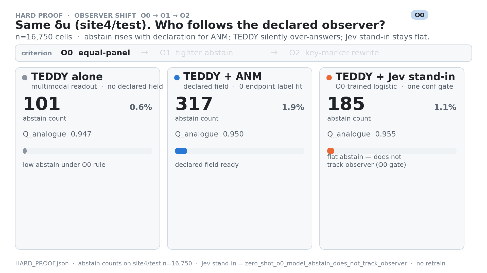
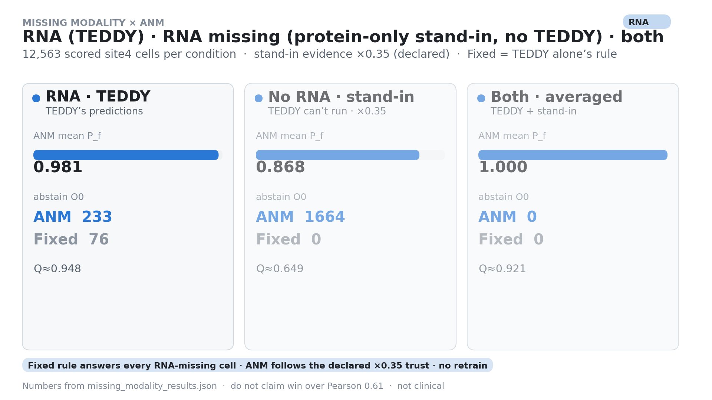
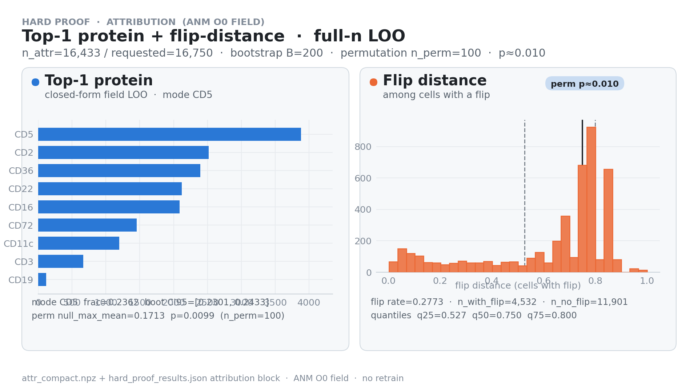
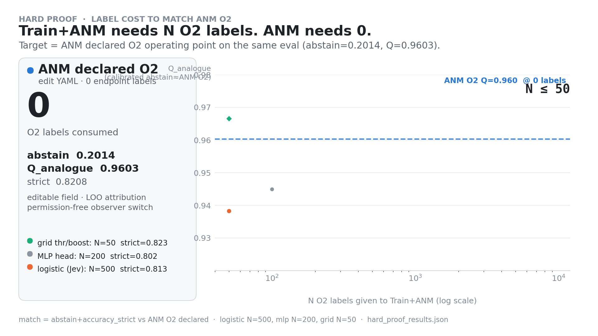

# TEDDY × ANM CITE bridge

Public landing (GitHub Pages): **[docs/index.html](https://danielchen26.github.io/teddy_mm/)** · source [`docs/`](docs/).

**Claim boundary (read first):** not clinical · not a Pearson win over phase-1 full-ADT **~0.61** · holdout `adt_true` = verifier only · Train+Jev = log-loss Choice stand-in (not a live Jev API) · no `best.pt` retrain. Numbers below cite only [`HARD_PROOF`](docs/reports/HARD_PROOF.md), [`SCOPE_REFINE_PROOF`](docs/reports/SCOPE_REFINE_PROOF.md), [`MISSING_MODALITY`](docs/reports/MISSING_MODALITY_ANM_DEMO.md).

Each capability section below follows the same pedagogy:

1. **What foundation-model scientists originally wanted** (plain English)
2. **Concrete TEDDY CITE example** a non-expert can follow — and where that goal breaks
3. **How we compare** TEDDY alone vs TEDDY+ANM vs Train+Jev (verified numbers only)
4. **GIF / figure last** (links into `docs/assets/`)

---

## Setup (shared across sections)

NeurIPS 2021 BMMC CITE · holdout **site4/test n=16,750**.

`RNA → frozen TEDDY-G → z_512 → ADT panel preds → typed δu events → ANM P_f / Q_f`

| Arm | What it is | Structural limit |
|---|---|---|
| **TEDDY alone** | Panel-mean / threshold rules | Silent over-answer; criterion change needs label retune; no declared-field LOO |
| **TEDDY + ANM** | Declared P_f / Q_f field (YAML observers O0/O1/O2) | Edit declaration only; full-n LOO attribution |
| **Train + Jev stand-in** | Logistic / MLP / grid calibration | Needs O2 labels to match; O0-trained abstain stuck at **185**; no editable-field attribution |

Phase-1 TEDDY+MLP full-ADT Pearson on the export slice: **0.610** (~0.61). Accuracy is secondary on every section.

---

## 1 · Edit the question without retrain

### 1 · What foundation-model scientists originally wanted

Train **one RNA→protein map**, freeze a readout head, maximize a single score (Pearson on the ADT panel). The “question” is baked in at train time.

### 2 · Concrete TEDDY CITE example

Collaborator asks first: *call each cell B / T / myeloid with equal marker weight (**O0**)*.  
Then: *same labels, abstain more when the margin is thin (**O1**)*.  
Then: *prefer key-lineage markers over equal panel mean (**O2**)*.

On site4/test: O0→O1 disagree rate **0.0000** (tighter abstain only). O0→O2 rewrites `expected_action` on **1,794 / 14,379** both-defined cells (rate **0.1248**) — e.g. many myeloid→B flips when key markers dominate.

**Where it breaks:** a frozen Pearson head cannot rewrite the decision field. Changing O0→O2 means new labels + retune for TEDDY-alone / Train+Jev — or keep answering the old question.

### 3 · How we compare (HARD_PROOF)

| Arm | O0 Q | O0 abstain | O1 Q | O1 abstain | O2 Q | O2 abstain | Criterion change cost |
|---|---:|---:|---:|---:|---:|---:|---|
| TEDDY alone | 0.9472 | 101 | 0.9735 | 881 | 0.9428 | 1,796 | Needs label retune |
| **TEDDY + ANM** | 0.9394 | **317** | 0.9578 | **834** | 0.8208 | **3,373** | **Declaration only** |
| Train+Jev (O0 zero-shot) | 0.9552 | 185 | 0.9733 | 185 | 0.8277 | 185 | Abstain does not follow observer |

Also: TEDDY-alone O0 rule still answers on **780** cells where O1 abstains and **1,752** where O2 abstains.

### 4 · Figure last



*Observer shift on the same TEDDY δu: ANM abstain climbs 317→834→3,373; Train+Jev stays flat at 185; TEDDY-alone over-answers where the new observer abstains.*  
([Pages](https://danielchen26.github.io/teddy_mm/) · dark: [`observer_shift_o0o1o2_dark.gif`](docs/assets/hard_proof/observer_shift_o0o1o2_dark.gif))

---

## 2 · Abstain when a modality is missing

### 1 · What foundation-model scientists originally wanted

A multimodal predictor that **always answers** from whatever channels are present, keeping Pearson high under joint RNA+ADT.

### 2 · Concrete TEDDY CITE example

Same site4 cells, three masks: `rna_only` (sequencer OK, antibody panel offline), `adt_only` (only surface proteins today), `joint`. A core facility drops RNA for one batch of 12,563 cells — should lineage calls stay as confident as with both channels?

**Where it breaks:** under weak `adt_only`, TEDDY-alone O0 abstain = **0** (silent over-answer) while Q ≈ 0.63. Always-answering ≠ trustworthy. Panel Pearson (rna_only≈0.915, adt_only≈0.446, joint≈0.870) is secondary; full-ADT phase-1 reference stays ~0.61.

### 3 · How we compare (MISSING_MODALITY)

| Mask | TEDDY O0 Q | TEDDY O0 abstain | ANM O0 Q | ANM O0 abstain | ANM O0 mean P_f | ANM O2 abstain |
|---|---:|---:|---:|---:|---:|---:|
| `rna_only` | 0.9450 | 76 | 0.9479 | 233 | 0.9815 | 2,459 |
| **`adt_only`** | 0.6277 | **0** | 0.6494 | **1,664** | 0.8675 | **12,563 (all)** |
| `joint` | 0.9150 | 0 | 0.9214 | 0 | 1.0000 | 785 |

Train-retune under `adt_only` plateaus at Q≈0.68–0.70 even with 1,000 O2 labels — still no editable-field LOO (flip_rate≈0.71).

### 4 · Figure last



*Mask animation: on `adt_only`, ANM abstain jumps and mean P_f drops; TEDDY-alone keeps answering (abstain 0).*  
([dashboard](docs/assets/missing_modality/missing_modality_dashboard_light.png) · [Pages](https://danielchen26.github.io/teddy_mm/#missing))

---

## 3 · Attribute which marker flipped the call

### 1 · What foundation-model scientists originally wanted

Once Pearson is good enough: **which input features drove the prediction?** Usual tools = saliency / SHAP / top-expressed markers — not flip distance on a declared decision field.

### 2 · Concrete TEDDY CITE example

A reviewer picks a cell called T-lineage under O0: *“If we drop CD5, does the call flip — and how far was the margin?”* That is leave-one-out on the declared protein field. On full site4, top-1 flip concentration includes CD5 (3,882), CD2 (2,516), CD36 (2,394).

**Where it breaks:** panel-mean heuristics and Train heads lack closed-form LOO / flip-distance on an editable observer field.

### 3 · How we compare (HARD_PROOF)

| Metric | TEDDY+ANM | TEDDY alone / Train+Jev |
|---|---|---|
| n_attr (full-n LOO) | **16,433** | no declared-field LOO |
| top-1 flip rate | **0.277** | — |
| flip-distance q50 | **0.75** | — |
| permutation p (n_perm=100) | **≈0.0099** | — |
| bootstrap B=200 | mode CD5 | — |

Matching abstain numerically still does **not** buy attribution.

### 4 · Figure last



*Top-1 protein histogram and flip-distance quantiles on the declared O0 field.*  
([dashboard](docs/assets/hard_proof/dashboard_hard_proof_light.png) · [Pages](https://danielchen26.github.io/teddy_mm/#attr))

---

## 4 · Gate for conditional accuracy (scope refine)

### 1 · What foundation-model scientists originally wanted

One global accuracy / Pearson on the **full** test set — every cell equally worth answering; maximize average score at coverage = 1.

### 2 · Concrete TEDDY CITE example

A sorting experiment can confirm only ~40% of cells. Raise τ on `soft_P = max(action_scores)` so conditional Q climbs as coverage shrinks. Separately, ANM LOO marks **flip-sensitive** cells (harder scope): Q **0.8099** vs random same-n **0.9458**.

**Where it breaks:** full-coverage Pearson hides barely-decided cells. Without a workability gate or attributed-hard scope, you cannot trade coverage for conditional correctness or prioritize which cells to label next.

### 3 · How we compare (SCOPE_REFINE_PROOF)

| Setting | Baseline Q @cov=1 | Peak / best Q | ΔQ | Note |
|---|---:|---:|---:|---|
| O0 soft_P gate | 0.9453 | 1.0000 · @cov≥0.4 → 0.9984 | **+0.0547** | peak @cov≈0.067 |
| O2 soft_P gate | 0.9149 | 0.9703 | **+0.0554** | best @cov≈0.765 |
| adt_only O0 soft_P | 0.6288 | 0.9494 | **+0.3206** | peak @ low cov |

| Cell scope | Q | n decided |
|---|---:|---:|
| Full panel cells | 0.9453 | 15,711 |
| Flip-sensitive (ANM LOO flipped) | **0.8099** | 3,724 |
| Non-flip | 0.9948 | 11,818 |
| Random same-n as flip (40 draws) | 0.9458 ± 0.0027 | 4,557 |

ΔQ (flip − random) = **−0.1359**. At n=50 labels, hard-scoped training beats random on hard holdout (logreg ΔQ ≈ **+0.034**). TEDDY alone “always answer” is the cov=1 baseline; Train can fit a head on hard labels but lacks the declared soft_P field that produced the scope.

### 4 · Figure last

No dedicated GIF for this section — primary artifacts are the tables above and [`SCOPE_REFINE_PROOF.md`](docs/reports/SCOPE_REFINE_PROOF.md). See also the HARD_PROOF [dashboard](docs/assets/hard_proof/dashboard_hard_proof_light.png).

---

## 5 · Zero-label criterion transfer vs label-cost calibration

### 1 · What foundation-model scientists originally wanted

After the RNA→protein map is trained, adapt to a **new downstream rubric** by collecting more labels and fitting a small head / calibrator. Cost = labeled cells; success = matching accuracy / abstain.

### 2 · Concrete TEDDY CITE example

Mid-project the scoring rule changes O0→O2. ANM already sits at abstain≈0.201, strict≈0.821 with **zero** new endpoint labels. Train+Jev must re-annotate under O2 and calibrate until abstain≈0.20 and strict≈0.82.

**Where it breaks:** even after ≈50–500 O2 labels, Train still has no editable-field attribution and must re-spend labels on the next observer edit. Numerical match ≠ criterion ownership.

### 3 · How we compare (HARD_PROOF)

| Method | n O2 labels to match | strict (labeled) | abstain | Editable field? |
|---|---:|---:|---:|---|
| grid_calibrated | ≈50 | 0.8227 | 0.2063 | No |
| mlp_calibrated | ≈200 | 0.8020 | 0.1976 | No |
| logistic (Jev stand-in) | ≈500 | 0.8129 | 0.2025 | No |
| **ANM declaration O2** | **0** | target ≈0.821 | ≈0.201 | **Yes** |

O0-trained Train abstain stays **185** across O0/O1/O2 until retuned.

### 4 · Figure last



*Logistic Q-gap vs ANM shrinks as O2 labels grow (50→5,000) — numerical match only; never buys a declared field or LOO flip distances.*  
(dark: [`label_cost_curve_dark.png`](docs/assets/hard_proof/label_cost_curve_dark.png) · [Pages](https://danielchen26.github.io/teddy_mm/#labels))

---

## Proof sentence

> On the same TEDDY δu (site4/test full-n), ANM declaration edits the observer (O0→O1 tighter abstain; O0→O2 rewrites expected_action) with zero endpoint-label fit, keeping verifiable P_f/Q_f and auditable full-n LOO attribution (n_attr=16,433, bootstrap B=200, permutation p≈0.0099). TEDDY-alone silently over-answers where the declared observer abstains; Train+Jev must consume O2 labels to approach ANM’s O2 operating point and still cannot buy editable-field attribution. Accuracy is secondary; not clinical. Do not claim Pearson > 0.61.

| What | Where |
|---|---|
| Landing page | [`docs/`](docs/) · [GitHub Pages](https://danielchen26.github.io/teddy_mm/) |
| Bridge code | [`bridge_anm/`](bridge_anm/) |
| Proof reports | [`docs/reports/`](docs/reports/) · also under `outputs/anm_cite_bridge/` |
| Key GIFs | `docs/assets/hard_proof/`, `docs/assets/missing_modality/` |

### 中文摘要（可选）

每一节：（1）基础模型原先要解决什么；（2）TEDDY CITE 具体例子 + 问题一变/模态缺失/需要归因时哪里断；（3）三臂对照只用 HARD_PROOF / SCOPE / MISSING 核实数字；（4）GIF 放最后。不重训 TEDDY；不声称 Pearson > ~0.61；非临床。

---

## Re-run (no TEDDY retrain)

```bash
cd teddy_mm
PYTHONPATH=/path/to/ANM:. .venv/bin/python bridge_anm/run_hard_proof.py --attr-n 0 --n-boot 200 --n-perm 100
PYTHONPATH=/path/to/ANM:. .venv/bin/python bridge_anm/run_scope_refine_proof.py
# missing modality: see bridge_anm/ or docs/index.html#rerun
```

Criteria YAML: `bridge_anm/readouts/cite_lineage_O{0,1,2}.yaml`.

---

# TEDDY multimodal phase-1

冻结 TEDDY 编 RNA，预测 NeurIPS 2021 BMMC CITE 的表面蛋白。
对照：MLP vs latent flow matching。

为 Mac M4 Max 128GB（MPS）写的。不要在这台机器上预训练第二模态。

## 一次性安装

```bash
cd teddy_mm
python3.11 -m venv .venv
source .venv/bin/activate
pip install -r requirements.txt
export PYTORCH_ENABLE_MPS_FALLBACK=1
```

TEDDY-G 70M 权重应在 `../teddy_mwe/ckpt/teddy_g_70M/`（先跑 `teddy_mwe/setup.sh`）。

## 正式数据（约 587 MB）

```bash
bash scripts/01_download_cite.sh
python scripts/02_prepare_cite.py
python scripts/03_embed_rna.py --device mps --seq-len 1024 --batch-size 16
python scripts/04_train.py --device mps
python scripts/05_eval.py --device mps
```

编码 9 万细胞、seq=1024，在 M4 Max 上大概数小时，只做一次。  
想先冒烟：

```bash
python scripts/02_prepare_cite.py --max-cells 4000
python scripts/03_embed_rna.py --seq-len 256 --batch-size 8 --device mps
python scripts/04_train.py --epochs 8 --device mps
```

没有 GEO 文件时可用合成数据测训练环：

```bash
python scripts/00_smoke_synthetic.py
python scripts/04_train.py --processed data/processed/cite_smoke --out outputs/smoke --epochs 5 --device cpu
```

## 切分

- test = `site4`（数据集里的held-out site）
- val = 从剩余 donor 里抽 10%
- train = 其余

## 现在做什么 / 还不做什么

做：RNA → ADT，冻结 TEDDY，MLP 基线 + FM。  
不做：ATAC foundation、解冻 400M、三模态联合生成。

双向 / 模态缺失是下一期：给 ADT 加 encoder，训练时 drop RNA。

## Phase-2 bidirectional CITE (scaffold)

Independent of full phase-1 90k embed. ADT encoder (CLR/log → shallow MLP) +
modality dropout (~18% drop RNA) + latent FM with `cond = z_obs`. No ATAC /
perturb-seq / 160M.

**Do not** write into `data/processed/cite/` or `outputs/cite_phase1/` while
phase-1 is running. Use a separate pack:

```bash
# Option A — tiny synthetic (immediate)
python scripts/00_smoke_synthetic.py
python scripts/06_train_bidirectional.py \
  --processed data/processed/cite_smoke --out outputs/cite_phase2 \
  --epochs 5 --device cpu

# Option B — 4k real CITE in a NEW dir (does not touch data/processed/cite)
python scripts/02_prepare_cite.py --max-cells 4000 --out data/processed/cite_phase2_4k
# Prefer CPU while phase-1 owns MPS:
python scripts/03_embed_rna.py --processed data/processed/cite_phase2_4k \
  --device cpu --seq-len 256 --batch-size 4
python scripts/06_train_bidirectional.py \
  --processed data/processed/cite_phase2_4k --out outputs/cite_phase2 \
  --epochs 8 --device mps   # or cpu if MPS still busy

# After full phase-1 z_rna exists, same script on the full pack:
# python scripts/06_train_bidirectional.py \
#   --processed data/processed/cite --out outputs/cite_phase2 --epochs 40 --device mps
```

Config: `configs/phase2_cite.yaml`. Code: `teddy_mm/bidirectional.py`,
`teddy_mm/modality_dropout.py`, `scripts/06_train_bidirectional.py`.
