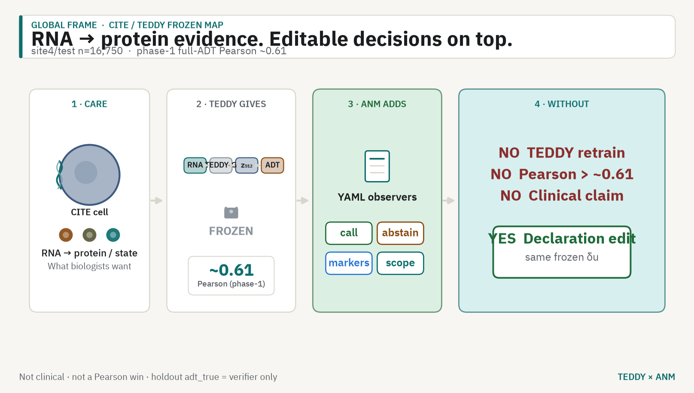
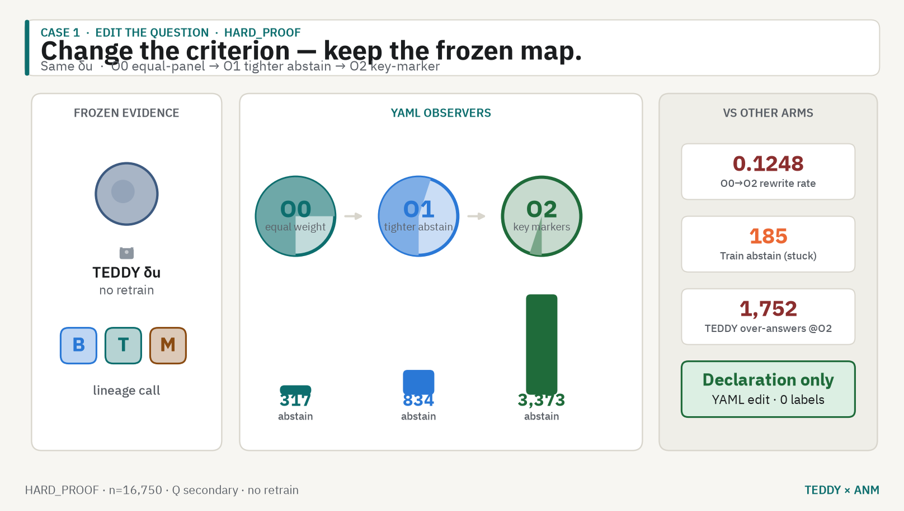
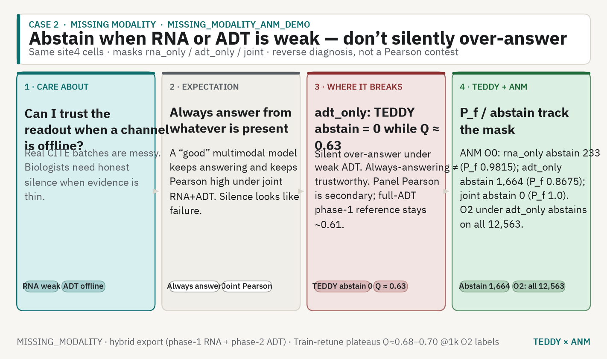
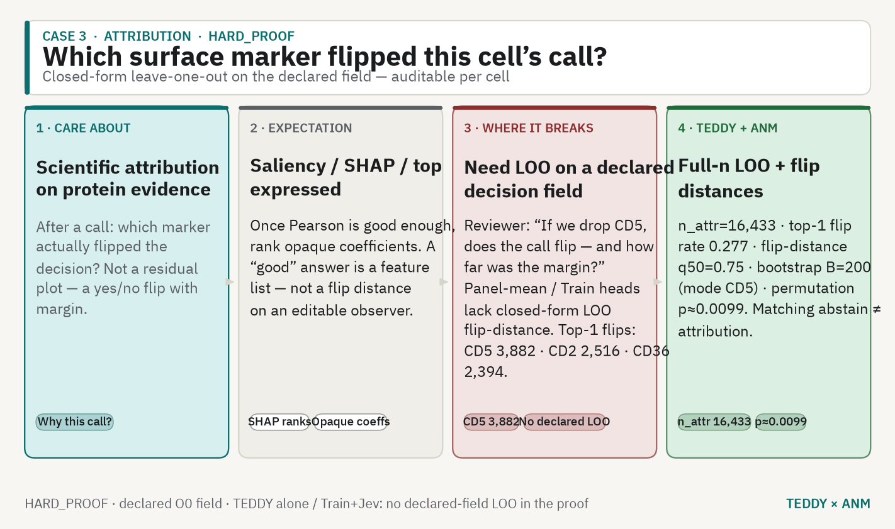
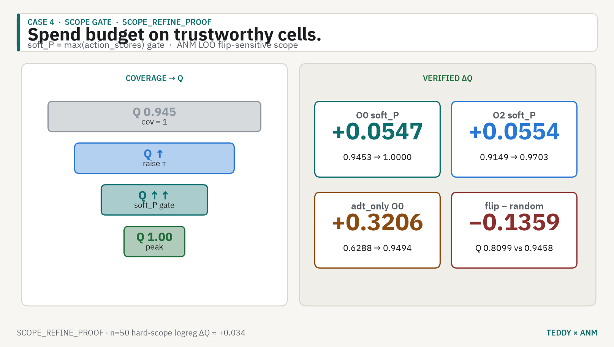
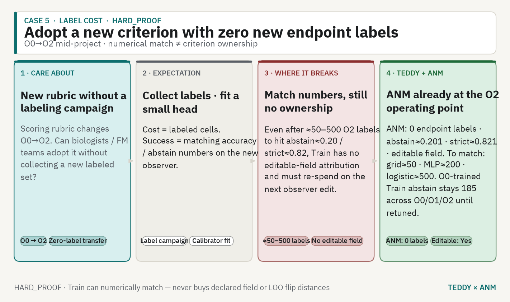

# TEDDY × ANM CITE bridge

Public landing: **[docs/index.html](https://danielchen26.github.io/teddy_mm/)** · source [`docs/`](docs/).

**Claim boundary:** not clinical · not a Pearson win over phase-1 full-ADT **~0.61** · holdout `adt_true` = verifier only · Train+Jev = log-loss stand-in · no `best.pt` retrain. Numbers cite [`HARD_PROOF`](docs/reports/HARD_PROOF.md), [`SCOPE_REFINE_PROOF`](docs/reports/SCOPE_REFINE_PROOF.md), [`MISSING_MODALITY`](docs/reports/MISSING_MODALITY_ANM_DEMO.md). Full Mode B scope: [`docs/MODE_B_SCOPE.md`](docs/MODE_B_SCOPE.md).

### What this repo claims / does not

| | |
|---|---|
| **Mode B (implemented)** | TEDDY as typed evidence source → ANM **finite_field** decisions; editable observer YAML (O0/O1/O2); missing-modality abstain demos; LOO/flip attribution on **decisions** |
| **NOT claimed (Mode A+)** | Residual stream as field · layer Jacobian · in-silico gene perturbs · gated ±ε / ±ε/2 G1–G4 · reverse closed loop · fusion audit · ATAC/chromatin |
| **`z_512` definition** | Mean-pool **last-layer** tokens at context length **1024** (not TEDDY pretrain 2048, not a disease token). Loading factor for CITE embed (`scripts/03_embed_rna.py`). Bridge export may store L2-normalized `z_keep=32` sidecar only. |
| **Conclusions about** | **Decision-layer** sensitivity to TEDDY evidence — not TEDDY representation response to perturbs. Cannot yet answer whether z is sufficient for protein readout. |
| **Honest weak arm** | ADT-only is a weak model; abstain story is honest silence, not a Pearson contest. |

---

## Hero

TEDDY freezes a CITE RNA→protein map (`z_512` = mean-pool last-layer @1024, Pearson ~0.61). **Mode B:** ANM edits the decision field on that typed evidence — call, abstain, markers, scope — without retraining TEDDY and without claiming Pearson > ~0.61 (not Mode A / residual / Jacobian / gene-perturb).



*CITE cell → frozen TEDDY map → ANM editable decisions. Dark: [`00_global_frame_dark.png`](docs/assets/infographics/00_global_frame_dark.png).*

**Setup.** site4/test n=16,750 · `RNA → frozen TEDDY-G → z_512 → ADT preds → δu → ANM P_f/Q_f`

| Arm | Role |
|---|---|
| TEDDY alone | Panel rules · silent over-answer · no declared LOO |
| **TEDDY + ANM** | YAML observers · abstain tracks declaration · full-n LOO |
| Train + Jev | Needs O2 labels · abstain stuck at **185** · no editable field |

---

## 1 · Edit the question



O0→O1→O2 on the same frozen δu. ANM abstain climbs with the YAML observer; Train stays flat; TEDDY-alone over-answers where the new observer abstains.

`0.1248` O0→O2 rewrite · `317→834→3,373` ANM abstain · `185` Train stuck · `1,752` TEDDY over-answers @O2


*([Pages](https://danielchen26.github.io/teddy_mm/#edit) · dark GIF: [`observer_shift_o0o1o2_dark.gif`](docs/assets/hard_proof/observer_shift_o0o1o2_dark.gif))*

---

## 2 · Missing modality



Under weak `adt_only`, TEDDY-alone abstain = 0 (Q ≈ 0.63). ANM abstain jumps to 1,664 — honest silence over silent over-answer.

`0` TEDDY abstain @adt_only · `1,664` ANM abstain · `12,563` ANM O2 (all) · `P_f 0.8675`


*([dashboard](docs/assets/missing_modality/missing_modality_dashboard_light.png) · [Pages](https://danielchen26.github.io/teddy_mm/#missing))*

---

## 3 · Attribution



Closed-form LOO on the declared field — not SHAP. Matching abstain ≠ attribution.

`16,433` n_attr · `0.277` top-1 flip · `0.75` flip-dist q50 · `≈0.0099` perm p · CD5 `3,882`


*([Pages](https://danielchen26.github.io/teddy_mm/#attr))*

---

## 4 · Scope gate



Raise τ on `soft_P` — spend follow-up budget on trustworthy cells. Flip-sensitive scope is harder than a random same-n draw.

O0 ΔQ `+0.0547` · O2 `+0.0554` · adt_only `+0.3206` · flip Q `0.8099` vs random `0.9458`

*No dedicated GIF — [`SCOPE_REFINE_PROOF.md`](docs/reports/SCOPE_REFINE_PROOF.md). [Pages](https://danielchen26.github.io/teddy_mm/#scope).*

---

## 5 · Zero-label transfer



ANM adopts O2 at **0** endpoint labels (abstain≈0.201, strict≈0.821, editable). Train needs ≈50 / 200 / 500 O2 labels to match numbers only.


*([Pages](https://danielchen26.github.io/teddy_mm/#labels))*

---

## Proof sentence

> On the same TEDDY δu (site4/test), ANM edits the observer with zero endpoint-label fit, keeping verifiable P_f/Q_f and auditable full-n LOO (n_attr=16,433, perm p≈0.0099). TEDDY-alone over-answers where the declared observer abstains; Train+Jev burns O2 labels and still cannot buy editable-field attribution. Not clinical. Do not claim Pearson > 0.61.

| What | Where |
|---|---|
| Landing | [`docs/`](docs/) · [GitHub Pages](https://danielchen26.github.io/teddy_mm/) |
| Mode B scope | [`docs/MODE_B_SCOPE.md`](docs/MODE_B_SCOPE.md) |
| Reverse step 1 | [`bridge_anm/reverse_step1_must_separate.py`](bridge_anm/reverse_step1_must_separate.py) · [`REVERSE_STEP1`](docs/reports/REVERSE_STEP1.md) |
| Bridge | [`bridge_anm/`](bridge_anm/) |
| Proofs | [`docs/reports/`](docs/reports/) |
| Story PNGs | `docs/assets/infographics/` (icon-first, light+dark) |
| GIFs | `docs/assets/hard_proof/`, `docs/assets/missing_modality/` |

Regenerate story figures: `python scripts/make_story_infographics.py`

### 中文摘要

TEDDY 冻结 CITE 上 RNA→蛋白证据（Pearson ~0.61）；ANM 在同一证据上可编辑决策。不重训 · 不声称 Pearson > ~0.61 · 非临床。图优先。

---

## Re-run (no TEDDY retrain)

```bash
cd teddy_mm
PYTHONPATH=/path/to/ANM:. .venv/bin/python bridge_anm/run_hard_proof.py --attr-n 0 --n-boot 200 --n-perm 100
PYTHONPATH=/path/to/ANM:. .venv/bin/python bridge_anm/run_scope_refine_proof.py
# missing modality: see docs/index.html#rerun
```

Criteria YAML: `bridge_anm/readouts/cite_lineage_O{0,1,2}.yaml`.

---

# TEDDY multimodal phase-1

冻结 TEDDY 编 RNA，预测 NeurIPS 2021 BMMC CITE 的表面蛋白。
对照：MLP vs latent flow matching。

为 Mac M4 Max 128GB（MPS）写的。不要在这台机器上预训练第二模态。

## 一次性安装

```bash
cd teddy_mm
python3.11 -m venv .venv
source .venv/bin/activate
pip install -r requirements.txt
export PYTORCH_ENABLE_MPS_FALLBACK=1
```

TEDDY-G 70M 权重应在 `../teddy_mwe/ckpt/teddy_g_70M/`（先跑 `teddy_mwe/setup.sh`）。

## 正式数据（约 587 MB）

```bash
bash scripts/01_download_cite.sh
python scripts/02_prepare_cite.py
python scripts/03_embed_rna.py --device mps --seq-len 1024 --batch-size 16
python scripts/04_train.py --device mps
python scripts/05_eval.py --device mps
```

编码 9 万细胞、seq=1024，在 M4 Max 上大概数小时，只做一次。  
想先冒烟：

```bash
python scripts/02_prepare_cite.py --max-cells 4000
python scripts/03_embed_rna.py --seq-len 256 --batch-size 8 --device mps
python scripts/04_train.py --epochs 8 --device mps
```

没有 GEO 文件时可用合成数据测训练环：

```bash
python scripts/00_smoke_synthetic.py
python scripts/04_train.py --processed data/processed/cite_smoke --out outputs/smoke --epochs 5 --device cpu
```

## 切分

- test = `site4`（数据集里的held-out site）
- val = 从剩余 donor 里抽 10%
- train = 其余

## 现在做什么 / 还不做什么

做：RNA → ADT，冻结 TEDDY，MLP 基线 + FM。  
不做：ATAC foundation、解冻 400M、三模态联合生成。

双向 / 模态缺失是下一期：给 ADT 加 encoder，训练时 drop RNA。

## Phase-2 bidirectional CITE (scaffold)

Independent of full phase-1 90k embed. ADT encoder (CLR/log → shallow MLP) +
modality dropout (~18% drop RNA) + latent FM with `cond = z_obs`. No ATAC /
perturb-seq / 160M.

**Do not** write into `data/processed/cite/` or `outputs/cite_phase1/` while
phase-1 is running. Use a separate pack:

```bash
# Option A — tiny synthetic (immediate)
python scripts/00_smoke_synthetic.py
python scripts/06_train_bidirectional.py \
  --processed data/processed/cite_smoke --out outputs/cite_phase2 \
  --epochs 5 --device cpu

# Option B — 4k real CITE in a NEW dir (does not touch data/processed/cite)
python scripts/02_prepare_cite.py --max-cells 4000 --out data/processed/cite_phase2_4k
# Prefer CPU while phase-1 owns MPS:
python scripts/03_embed_rna.py --processed data/processed/cite_phase2_4k \
  --device cpu --seq-len 256 --batch-size 4
python scripts/06_train_bidirectional.py \
  --processed data/processed/cite_phase2_4k --out outputs/cite_phase2 \
  --epochs 8 --device mps   # or cpu if MPS still busy

# After full phase-1 z_rna exists, same script on the full pack:
# python scripts/06_train_bidirectional.py \
#   --processed data/processed/cite --out outputs/cite_phase2 --epochs 40 --device mps
```

Config: `configs/phase2_cite.yaml`. Code: `teddy_mm/bidirectional.py`,
`teddy_mm/modality_dropout.py`, `scripts/06_train_bidirectional.py`.
