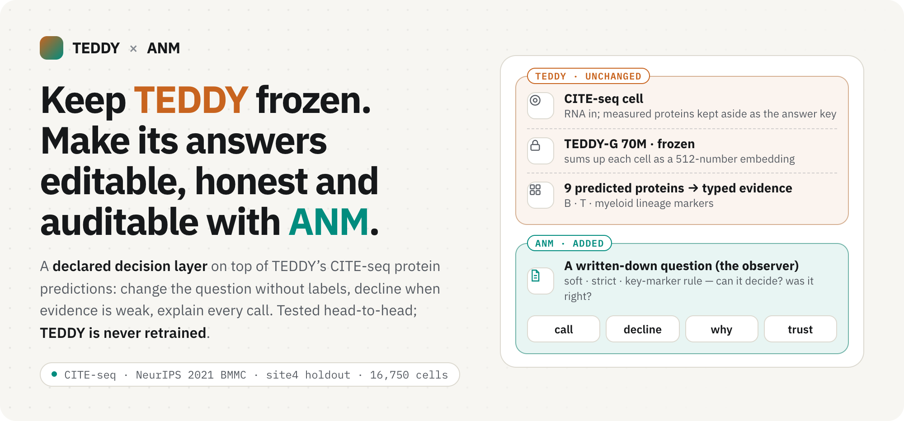
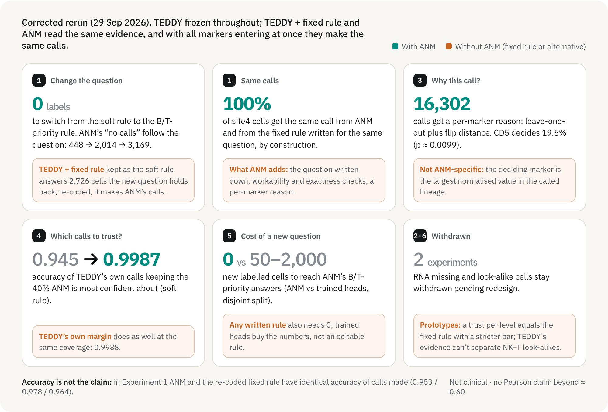
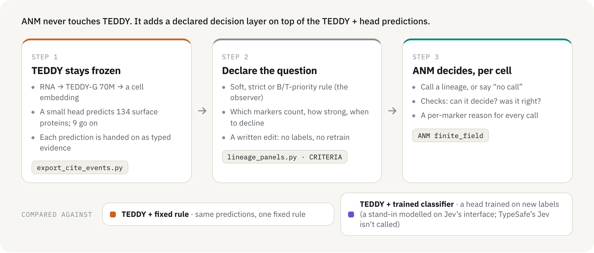

<div align="center">

<picture>
  <source media="(prefers-color-scheme: dark)" srcset="docs/assets/readme/hero-dark.png">
  
</picture>

<p>
  <a href="https://danielchen26.github.io/teddy_mm/"><b>Live site</b></a> ·
  <a href="https://danielchen26.github.io/teddy_mm/anm-loop.html"><b>Decision-loop report</b></a> ·
  <a href="https://danielchen26.github.io/teddy_mm/anm-framework.html"><b>How ANM works</b></a> ·
  <a href="#registered-experiments-v3"><b>Registered v3 results</b></a> ·
  <a href="#what-anm-brings-teddy-now">What ANM brings TEDDY now</a> ·
  <a href="#how-anm-and-teddy-connect">How ANM connects to TEDDY</a> ·
  <a href="#quickstart">Quickstart</a> ·
  <a href="#key-terms">Key terms</a> ·
  <a href="docs/reports/">Proof reports</a> ·
  <a href="#claim-boundary">Claim boundary</a>
</p>


</div>

## Registered experiments (v3)

**Status (2026-10-01): all eight registered experiments are final (E1–E5, E5-M, E6, E7).** Full report: [`docs/reports/V3_REGISTERED_RESULTS.md`](docs/reports/V3_REGISTERED_RESULTS.md); every v3 number with its source file and key: [`docs/reports/v3_numbers.json`](docs/reports/v3_numbers.json). Registration ([REGISTRATION_v3](https://github.com/danielchen26/teddy_mm/blob/exp/registered-v3/registration/REGISTRATION_v3.md), `registration_v3.json` sha256 `e4c8a33e…`), amendments [A1](https://github.com/danielchen26/teddy_mm/blob/exp/registered-v3/registration/AMENDMENT_A1.md), [A2](https://github.com/danielchen26/teddy_mm/blob/exp/registered-v3/registration/AMENDMENT_A2.md), [A3](https://github.com/danielchen26/teddy_mm/blob/exp/registered-v3/registration/AMENDMENT_A3.md) and the [addenda](https://github.com/danielchen26/teddy_mm/tree/exp/registered-v3/registration/addenda) are on GitHub, branch `exp/registered-v3` (E7 also has a [registration page](https://github.com/danielchen26/teddy_mm/blob/exp/registered-v3/registration/E7_REGISTRATION.md) and a committed [development selection record](https://github.com/danielchen26/teddy_mm/blob/exp/registered-v3/registration/addenda/E7_selection.json)).

The v1/v2 tests below had problems that made their headlines untestable or invalid: a three-class key with no NK or out-of-scope class, a panel chosen on the test set, a test donor also in training, measured protein in the evidence path, event order acting as a hidden weight, and no registered decision rules. v3 fixed each one, fixed every endpoint, margin and decision rule on train and validation data only, and ran each test once on the two site4 donors in no other split (13272 and 19593, 11,294 cells; donor 15078 is a secondary split that never changes a verdict). E6 repeated E1's main endpoints on 8 external donors (Hao et al. 2021 PBMC, 40,000 cells). **Where the sections below conflict with v3, v3 wins.**

**Bottom line.** The decision-gain claims that earlier versions of these pages made did not hold: in this setup ANM computes exactly a [declared rule](#t-declrule), on site4 and on the external data, and the registered tests found no decision value from ANM's readouts. A classifier trained only on the old question's labels answered a new question better than the zero-label rule. E2 was falsified, E3 rejected the repair claim, ANM's fusion lost to a validation-trained stacker in E4, and E5 stopped at its derivative check. **E5-M is inconclusive:** for E3's attention-pooling readout, at first order, the median share of its response that flows through what gene-mean pooling discards is 0.085 on NK–T look-alike cells and 0.127 on matched random cells, the opposite of the hypothesis (−0.043 [−0.062, −0.011]) but neither a registered loss nor equivalent; so neither "pooling loses the look-alike difference" nor "the gene-mean state is sufficient" is established, for this one observer. **E6** (external data, labelled "RNA possibly seen by TEDDY in pretraining" and "key not validated"): ANM equals the declared rule in every donor, and TEDDY's margin ranks the rule's calls better than the rule's (= ANM's) top score in 8 of 8 donors (−0.0087 [−0.0182, −0.0017], replicates; still inconclusive under E1's own decision rule); the site4 classifier advantage does not replicate. **E7** ran the inverse loop of the ANM paper's v2 revision (PR #16) on TEDDY at the layer-11 cut, with the consumer fixed (TEDDY's layer 12, gene-mean pooling and our frozen head). Registered verdict **REJECTED_NO_REVISION**: histories with exactly the same layer-11 gene-mean give readouts that differ beyond the 0.05 tolerance on fresh site4 comparisons (median 0.125 [0.090, 0.161] of the measured NK–T gap), the gene-mean plus the six marker genes' token states is rejected as well (0.122), and no candidate was selected in development. So the rejection step holds on TEDDY, the selection step returned no revision, and no revised representation is validated; the patches are exact state interventions, not biological variation. The answer key is weak for test donor 13272 ([kappa](#t-kappa) 0.4177), so every result is also reported on the [annotation-only key](#t-primkey), with equal prominence; on the external data the key is not validated (kappa 0.6562 < 0.70), so the annotation-only key decides E6.

| | Question | Registered verdict | Key numbers (95% CI) |
|---|---|---|---|
| **E1** | Decision layer: Experiments 1, 3, 4, 5 and nested readouts (C2), rerun | ANM = declared rule: **pass**. Rule vs Q1-label classifier on the changed question Q3: **loss**. Trust ordering (E1.4a), attribution (E1.3c): **inconclusive**. Closure readout (C2): **equivalent**, in-scope guard failed. Falsification clause holds | 0 mismatches (Q1, Q2, Q3); rule − classifier −0.078 [−0.134, −0.028] (annotation-only −0.054, loss); [AURC](#t-aurc) top score − margin −0.002 [−0.024, 0.020]; label cost n* = 0 |
| **E2** | Response decomposition and linearity | **adds nothing beyond the curve (falsified)** | decision-accuracy loss 0.022 / 0.162 / 0.140 with 80 / 20 / 5% of UMIs kept; criterion (ii) −0.092 [−0.125, −0.057], loss; at most 0.098 of cells linear |
| **E3** | NK–T look-alikes: repair on frozen TEDDY | **rejected**; NK-vs-T accuracy: R1 and R2 vs head **loss** at 0.9 and 0.8 | R1 − head −0.0409 [−0.0554, −0.0121], R2 − head −0.1925 [−0.2899, −0.0836]; head [gap ratio](#t-gapratio) 0.1169 flagged vs 0.3985 unflagged (descriptive; 0.4729 vs 0.5137 without gdT CD158b+ pairs) |
| **E4** | Two-channel fusion (Experiment 2 redesigned) | ANM fusion vs [stacker](#t-stacker): **loss** ("field hurts"); vs [trust-weighted average](#t-trustavg): **inconclusive** | −0.0815 [−0.1380, −0.0535]; +0.0034 [−0.0007, +0.0103]; channel 2 at t = 2: equivalent |
| **E5** | Layer dynamics inside TEDDY | **JVP not validated**: E5 stops | float32 [JVP](#t-jvp) gate pass share 0.854 < 0.95 at ε = 1e-3; float64 1.000 (79 cases) |
| **E5-M** | Is TEDDY's gene-mean state sufficient for an independent token observer (E3's attention-pooling readout R2), at first order? | **inconclusive** (Delta_tok neither win, loss nor equivalent); for this one observer only | median [clamp residual](#t-clamp) 0.085 on NK–T pair cells vs 0.127 on random cells; Δ_tok −0.043 [−0.062, −0.011]; pair-cell level 0.085 [0.071, 0.096] > 0.05, so not sufficient either; ANM's `analyze_factorization` (rtol 1e-4) REJECTED in 195 of 195 cells, source kernel NOT_INFORMATIVE in 195 of 195, as the paper predicts |
| **E6** | External confirmation of E1 (Hao et al. 2021 PBMC, GSE164378); labels: RNA possibly seen by TEDDY in pretraining, key not validated | E1.1a **replicates**; primary E1.4a **replicates** (E1 rule: inconclusive); primary C2 at c*: **no v3 direction** (equivalent); classifier advantage **does not replicate** | 40,000 cells, 8 donors; key kappa 0.6562 < 0.70 → annotation-only key decides; 0 mismatches in every donor; top score − margin AURC −0.0087 [−0.0182, −0.0017], 8 of 8 donors; C2 0.0000; top score − classifier 0.0010 [−0.0102, 0.0091]; every AURC 0.983–0.993 |
| **E7** | The paper's inverse loop at TEDDY's layer-11 cut, consumer fixed (layer 12 + gene-mean + frozen head): is the layer-11 gene-mean a sufficient retained state, and does a declared revision hold? | **REJECTED_NO_REVISION**: no candidate selected in development (nor in the declared follow-up); gene-mean and gene-mean + G **rejected** on fresh comparisons; all token states uninformative | tolerance 0.05 of the measured val NK–T gap; median D 0.125 [0.090, 0.161] (donors 0.094, 0.153), gene-mean + G 0.122 [0.086, 0.153]; development 95th percentiles 0.276 / 0.256; G witness 0.013 not detected; positive control 0.261 and detectability witness 0.260 detected; external (secondary) 0.112 [0.097, 0.136]; 0.022 at 1/32 of the non-G tokens, 0.125 at 1/2 |

**Fairness.** The registration, A2, A3 and the E2, E3, E4 and E5-M addenda were pushed to GitHub before the site4 evaluation they govern (E5-M: pushed 07:57:00 UTC, run started 10:43:09). The E6 addenda (v1 committed 10:07:39, v2 10:43:00) were pushed together at 10:43:44, before any external outcome; the E6 run started at 11:54:31 at local commit `cac4f8a`, which differs from the pushed `2a55f81` only in `docs/reports`. Before either E6 addendum, the data-preparation step had read some external protein summaries while the annotation map was being revised, so E6's registered order for the map was not met in time (disclosed; an independent re-derivation reproduced the map, 31 of 31 labels). For **E1 and E5** the governing files (A1, the E1 addendum, the E5 addendum v3) were committed locally before the evaluation but pushed only afterwards (07:57:00 UTC), so their ordering rests on local commit times and the sha256 recorded in each result file. **E1 was evaluated before A2 and A3**, which concern only E2 and E3. E5's cell selection rebuilt E3's site4 pairs before the E3 addendum, A2 and A3; only the pair count (253) was logged. **E7**: addendum v2 was pushed at 22:25:53 UTC, before any development run (22:26:38); the two development selection records were pushed at 22:40:19, and the site4 confirmation started at 22:40:20 by the local clock, 1 s later on a different clock (the result file records the record's sha256 and `committed: true`). Key validity: test kappa 0.5781 (registered threshold 0.85), donor 13272 0.4177, donor 19593 0.8798; 3,561 of the 11,294 test cells are unscored on the primary key. Full timeline: [report § 2.5](docs/reports/V3_REGISTERED_RESULTS.md#25-fairness-facts-and-timeline-utc).

**Claims ledger** (status: *registered* = a registered verdict or check decides it; *secondary* = reported, never decides; *descriptive* = a measurement with no decision rule). Most rows test decision-gain claims that earlier versions of these pages made; they are not ANM's purpose. Can-claim rows 13–16 come from ANM's own response tests on TEDDY (E5-M, E7).

<details open>
<summary><b>Can claim</b></summary>

1. In this setup ANM's engine computes exactly the declared rule, on site4 and on the external data; a check, not a gain. *Registered* (E1.1a: 0 mismatches, both test splits; E6: 0 in every external donor, 0 rejected events; E2: 0 over all cases; E4: engine = closed form).
2. ANM's leave-one-out attribution equals the exact closed form. *Registered* (E1.3a: agreement 1.0000 on 10,715 calls).
3. Pooled, one panel protein decides more calls than the 1/3 null in each class (CD11c 0.832 of myeloid, CD2 0.618 of T, CD94 0.572 of NK, CD20 0.484 of B calls); a property of the evidence that any rule reproduces; for B not by donor. *Secondary.*
4. On site4, a logistic classifier on the same 12 evidence values orders calls better than the rule's (= ANM's) top score: AURC 0.942 vs 0.843. This does not replicate on the external data (E6: 0.0010 [−0.0102, 0.0091], v3 sign in 2 of 8 donors). *Secondary.*
5. A classifier trained only on the old question's labels answers the new question better than the zero-label rule: −0.078, loss; n* = 0. Not run externally. *Registered.*
6. Operating points of TEDDY + head + Q1 rule. Unseen-donor site4 cells: coverage 0.949, selective accuracy 0.697 (annotation-only 0.730), out-of-scope decline 0.261. External PBMC data (annotation-only key; RNA possibly seen by TEDDY in pretraining): 0.993, 0.966, 0.292. *Descriptive.*
7. TEDDY + head + rule loses decision accuracy as RNA is thinned: 0.022 at 80% kept, 0.162 at 20% (0.140 at 5%). *Descriptive.*
8. The pipeline's response to these perturbations is not linear in their size (at most 0.098 of cells linear at any stage). *Descriptive.*
9. Two trained readouts of frozen TEDDY (a layer-mean MLP and attention pooling) separate NK from T worse than the registered head. *Registered* (E3.H3b losses).
10. A validation-trained stacker fuses the two channels best, and ANM's fusion loses to it (0.9353 vs 0.8538). *Registered.* On the E4 key the declared trust-weighted average also beats TEDDY + head alone (+0.0143), but not on the v3 primary key (+0.0073, inconclusive). *Secondary.*
11. The registered E5 derivative check failed in float32 at ε = 1e-3; the float64 version passes. *Registered.*
12. On the external data, TEDDY's margin ranks the declared rule's calls at least as well as the rule's (= ANM's) top score: ahead in all 8 donors, pooled interval below 0 (E6 primary E1.4a: −0.0087 [−0.0182, −0.0017], replicates). On site4 the same comparison was inconclusive (−0.002 [−0.024, 0.020]). *Registered* (E6 replication rule); under E1's own decision rule over the 8 donors: inconclusive. Key not validated; RNA possibly seen by TEDDY in pretraining.
13. For E3's attention-pooling readout R2, at first order on 195 site4 cells, the median share of its response that flows through what gene-mean pooling discards is 0.085 [0.071, 0.096] on NK–T look-alike pair cells and 0.127 on matched random cells: smaller, not larger, on look-alikes (Δ_tok −0.043 [−0.062, −0.011]; random token readout 0.067 / 0.068; derivative gate 1.000, positive control passed). *Registered measurement*; the registered verdict on H5M is inconclusive (E5-M). For this observer only; its attention is nearly uniform.
14. ANM's own factorization check rejects the gene-mean as an *exact* first-order retained state for R2, and its source-kernel test is uninformative in this setting, as the ANM paper predicts (rtol 1e-4: REJECTED in 195 of 195 cells; source kernel NOT_INFORMATIVE in 195 of 195; K_z full column rank in every cell). *Secondary* (E5-M S4).
15. For a fixed consumer (TEDDY's layer 12 + gene-mean pooling + our frozen head) and exact mean-preserving state interventions at the layer-11 cut, the layer-11 gene-mean is rejected as a sufficient retained state on fresh site4 comparisons, and so is the gene-mean plus the six marker genes' token states; no declared candidate was selected in development. This is the first step of the paper's inverse loop on TEDDY, with no revision (median D 0.125 [0.090, 0.161], donors 0.094 and 0.153; gene-mean + G 0.122 [0.086, 0.153]; development 95th percentiles 0.276 / 0.256 and follow-up 0.236 / 0.236; positive control 0.261 and detectability witness 0.260 detected; G witness 0.013 not detected). *Registered* (E7: REJECTED_NO_REVISION).
16. In E7 the readout difference grows with the size of the mean-preserving patch (site4 median D 0.022 at 1/32 of the non-G tokens, below the tolerance; 0.046 at 1/8; 0.073 at 1/4; 0.125 at 1/2), and it is larger in NK than in T cells (0.141 vs 0.091). *Secondary.*

</details>
<details open>
<summary><b>Cannot claim</b> (and the test that rejected it)</summary>

1. "ANM adds decision value as a decision layer on TEDDY": E1 falsification (neither E1.4 nor C2 is a win). E6: the engine equals the rule in every external donor, and the margin ranks calls better than the top score in 8 of 8 donors.
2. "ANM's confidence is a better trust gate than TEDDY's margin": E1.4a inconclusive; the gate claim stays withdrawn. E6: the direction against this claim replicates (−0.0087 [−0.0182, −0.0017]); the site4 0.90-coverage gain is secondary, belongs to the rule's top score, and does not replicate (−0.0023 [−0.0046, 0.0008]).
3. "ANM's nested (closure) readout declines out-of-scope cells better": C2 equivalent (0.000 [−0.006, 0.003]), in-scope guard failed (−0.056). E6: 0.0000, no v3 direction, guard failed (−0.0086).
4. "Editing the question with zero labels beats training" / "ANM saves labels": E1.1c/E1.1d loss; E1.5 n* = 0. Not run externally.
5. "Attribution flags wrong calls better than TEDDY's margin": E1.3c 0.004 [−0.008, 0.022], inconclusive.
6. "The representation / head / decision split tells more than the accuracy curve": E2 falsified.
7. "The NK–T loss is in the readout or pooling and is repairable on frozen TEDDY": E3 rejected.
8. "The NK–T loss is in mean pooling" / "pooling discards NK–T information that a token readout uses on look-alike cells": E3 pooling contrast −0.0375 [−0.4408, 0.22], inconclusive; E5-M: H5M not supported, and for R2 the look-alike excess has the opposite sign (Δ_tok −0.043 [−0.062, −0.011]).
9. "ANM's field fuses evidence channels better": E4 loss against the stacker, inconclusive against the trust-weighted average.
10. "A specific TEDDY layer localises the NK–T loss": E5 not validated; its computed l* = 11 does not match the probe layer 9 either.
11. Any population-level statement: two site4 donors and 8 external donors; the intervals describe these donors.
12. Any v1/v2 headline as a v3 result (the first run's ANM accuracy edge, "0 vs 50–1,000 labels", the confidence gate, the NK–T compression example).
13. "TEDDY's gene-mean state is sufficient for an independent observer on look-alikes" / "pooling is not the problem; the NK–T loss is in our head": E5-M PASS_SUFFICIENT not reached; the pair-cell level is 0.085 [0.071, 0.096], above 0.05, and Δ_tok is not equivalent. Measured for one near-uniform observer only.
14. "A trained classifier orders calls better than the rule in general": site4 only; E6 0.0010 [−0.0102, 0.0091], does not replicate.
15. "E6 confirms v3 on data TEDDY never saw, with a validated key": contamination answer "likely yes"; key not validated (0.6562 < 0.70).
16. "E7 validates a revised TEDDY representation" / "the reject → select → validate loop is complete on TEDDY" / "the six marker genes' token states carry what the consumer needs": E7 REJECTED_NO_REVISION; nothing was selected in development or in the follow-up, gene-mean + G is rejected on fresh comparisons, and the G witness is not detected (0.013).
17. "E7 explains or locates the NK–T loss", says what the RNA contains, or describes biological variation between cells: E7's patches are exact state interventions at the layer-11 cut (off-manifold), for one fixed consumer; it never changes the input RNA.

</details>
<details open>
<summary><b>Not tested</b></summary>

1. ANM's field dynamics (retention over real processing steps, multi-step propagation, histories, feedback): every event enters at t = 0, so the field is a constant gain per class (G(3)·3·S).
2. Sufficiency of TEDDY's gene-mean for other observers (sharper attention, nonlinear readouts), for larger pushes, and on more cells: partly tested, one observer at first order on 195 cells (E5-M); R2's attention is nearly uniform (median 1,141.957 effective of 1,368 tokens). E7 tests the layer-11 gene-mean for layer 12 + our head under finite mean-preserving state interventions (rejected), not the layer-12 gene-mean for another observer.
3. Replication on data TEDDY has certainly not seen, and external replication of E1.1b–d, E1.3, E1.5 and of E2–E5-M: partly tested (E6, whose data are labelled RNA possibly seen by TEDDY in pretraining; it ran E1.1a, E1.4a, E1.C2 and Q1 accuracy only; E7 ran on the same donors as a secondary family).
4. Pretraining contamination of TEDDY with this dataset (GSE194122): not verified.
5. The effect of the head's global ADT-median size factor (computed over all cells, site4 included) on its weights: not testable without retraining.
6. Retraining TEDDY or the head; other heads, panels or questions.
7. Comparison with TypeSafe AI's Jev: never called.
8. A validated layer-wise linear response in TEDDY (E5's question): the float64 path was not registered before site4; E5-M's own derivative gate passed, but it validates E5-M's derivatives and does not answer E5's layer question.
9. The validation step of the inverse loop on TEDDY (a revised representation selected and then supported on fresh comparisons), other cuts and consumers, a richer candidate library, and on-manifold (real-cell) perturbations: E7's declared library had no candidate that passed in development, so nothing reached validation.

</details>

**What ANM is here.** ANM measures a response chain: push one source by a known amount and measure separately how the retained state and the readout move (source → state, source → readout). That shows where information is lost, either not carried by the state or carried but not used by the readout (forward), and which distinctions the state must keep (inverse). The source side is an intervention, so the source → readout response is interventional, but the paper does not establish that the readout change passes through the state: "the dashed state-to-readout relation is a hypothesis, not an established causal path" (PR #16, draft, at `aa9e2c20`: `sections/introduction.tex` 85; also `sections/protocol.tex` 129, `sections/discussion.tex` 96). In the ANM v2 pre-release draft (commit `bab56c34`, not yet released; line numbers without "PR #16" refer to it) the retained state is a [candidate](#t-candidate) ("a candidate retained coordinate … Its choice does not establish sufficiency", `sections/protocol.tex` 7–11). For a declared observer (readout, perturbations, window), the same responses test and select it: a candidate is rejected when identical states give resolved differences in output distributions (PR #16 `abstract.tex` 9–11); then, within a candidate set declared in advance, the candidates with no observed same-state violation are kept and the one with the fewest states is selected, fixed and validated on new comparisons (PR #16 `sections/worked_example.tex` 4–10, 105–107). In the paper's exact construction this gives the coarsest sufficient representation, 2 states (PR #16 `sections/worked_example.tex` 71). Limits: the candidate set is declared in advance, so this selects rather than discovers new variables ("within a specified candidate set", PR #16 `sections/worked_example.tex` 6), and choosing a candidate still "does not establish sufficiency" (`sections/protocol.tex` 7–11). The readout-visible quotient is an SI diagnostic, not "the state ANM finds". For its AI studies the draft says: "Fixed graph updates propagate and retain these increments; a separate model or program reads the resulting state. The delayed-tool study instead retains request–return histories." (`sections/ai_evidence.tex` 7–9). Our reading, not the paper's words: these workflows are open-loop in the sense that readouts do not feed back into the graph state or its sources (the constructed graph itself has reciprocal couplings). PR #16 adds one restricted inverse test with a fixed model consumer: on recipient A only, 768 new calls (512 base + 256 control) reject a snapshot description (histories with the same snapshot but opposite routing differ by at least 0.8358 in total variation), and an association description chosen from declared candidates gets bounded support on four new histories and two continuation combinations (total-variation upper bounds at most 0.0821, below the fixed margin 0.15). The broader development screen selected none, and support came only after the readout was restricted to recipient A, a scope chosen after that screen. All 768 answers matched the reference, so support there coincides with the model answering correctly (our observation). The consumer is unchanged, so this validates the analyst's description, not a repair of the model. On TEDDY, E7 ran exactly this reject → select → validate loop at the layer-11 cut with the consumer fixed, and selected nothing: the layer-11 gene-mean was rejected on fresh comparisons (median D 0.125 [0.090, 0.161]) and so was the gene-mean plus the six marker genes' token states (0.122); development and the declared follow-up selected none, so nothing reached validation. In teddy_mm every event enters at t = 0, so ANM's decision-layer calls equal a re-coded rule; its checks confirmed that the declared readouts are what the engine computes, on site4 and on the external data. Its response tools gave one validated measurement about TEDDY: E5-M ran ANM's sufficiency machinery end to end and measured how much of one near-uniform observer's first-order response passes through what pooling discards, with an inconclusive registered verdict; E7 rejected the layer-11 gene-mean for a fixed consumer, with no revision selected; E2 and E5 produced no validated finding. **Overall:** ANM's role is to measure the response chain and to test and select candidate retained states for a declared readout. In this project that gave one first-order measurement for one observer (E5-M, inconclusive) and one reject → select → validate run that selected nothing (E7: the layer-11 gene-mean rejected, no revision). The decision-gain tests (E1, E4, E6) tested claims that earlier versions of these pages made; they are not ANM's purpose.

> **中文（论文表述）：** ANM 测的是一条响应链：把一个源推动已知的量，分别测量保留状态和读出怎么变，从而看出信息在哪里丢失（状态没带上，或带上了但读出没用上），以及状态必须区分什么。源一端是干预，但论文没有证明读出的变化经由该状态传递（PR #16 `sections/introduction.tex` 85："the dashed state-to-readout relation is a hypothesis, not an established causal path"）。声明观测者（读出、扰动、时间窗）之后，同样的响应还能检验并选择保留状态：同一状态下输出分布有可分辨差异的候选被否决；在事先声明的候选集合里，保留没有违例的候选，选出状态数最少的那个，固定后用新的比较验证（PR #16 `sections/worked_example.tex` 4–10、105–107；在精确构造中得到最粗的充分表示，2 个状态，71 行）。候选集合是给定的，所以这是选择而不是发现新变量。ANM v2 待发布稿（commit `bab56c34`，尚未发布）对 AI 研究的原文是 "Fixed graph updates propagate and retain these increments; a separate model or program reads the resulting state. The delayed-tool study instead retains request–return histories."（`sections/ai_evidence.tex` 7–9）。"开环，指读出不会反馈到图状态或源（构造的图内部本身有双向耦合）"是我们的解读，不是论文原话。论文 v2 修订版 PR #16（草稿，位于 `aa9e2c20`）新增一项范围受限、消费者固定的逆向检验：仅针对接收者 A，768 次新调用（512 次基础 + 256 次对照）否决了快照描述（快照相同、路由相反的历史，差异下界至少 0.8358），从声明候选中选出的关联描述在四个新历史和两个后续组合上获得有界支持（上界至多 0.0821，低于固定容差 0.15）；较广的开发筛选未选出任何候选，只有把读出限定为接收者 A（范围在那之后确定）后才得到支持；768 个回答全部答对，所以那里的"支持"与模型答对重合（我们的观察）。消费者不变，验证的是分析者的描述，不是对模型的修复。TEDDY 上的 E7 在第 11 层切点、消费者固定时运行了这一"否决 → 选择 → 验证"闭环，什么也没选出：否决步骤成立（gene-mean 0.125 [0.090, 0.161]，加六个标记基因 token 状态 0.122），开发阶段与事先声明的后续都没有选出候选，因此没有进入验证。ANM 的作用是测量响应链、为声明的读出检验和选择候选保留状态；决策增益检验（E1、E4、E6）检验的是早期页面的说法，不是 ANM 的目的。<br><br>**中文摘要：** v3 八项预注册实验全部完成：ANM 在本设置中与声明规则逐细胞判定相同（site4 与外部数据皆然），预注册检验未发现 ANM 读出带来决策价值；仅用旧问题标签训练的分类器优于零标签规则；E2 被证伪，E3 拒绝“可在冻结 TEDDY 上修复”，E4 中 ANM 融合不敌验证集堆叠器，E5 的导数检验在 float32 下未通过；E5-M 判定为不确定（R2 观察者响应流经池化丢弃部分的份额：相似细胞 0.085，随机细胞 0.127，仅针对这一个观察者，既不能说池化丢失信息，也不能说基因均值状态充分）；E6（外部数据，RNA 可能已被 TEDDY 预训练见过，答案键未验证）复现了 ANM = 声明规则，以及 TEDDY 的 margin 在 8/8 供体中排序优于顶分（按 E1 判定规则仍为不确定），分类器优势未复现；E7（论文逆向闭环在 TEDDY 第 11 层切点的类比，消费者固定）判定为 REJECTED_NO_REVISION：第 11 层 gene-mean 相同的历史在新的 site4 比较上读出差异超过容差（0.125 [0.090, 0.161]，容差 0.05），加六个标记基因 token 状态的候选也被否决，开发阶段未选出修订，没有验证任何修订后的表示（状态干预，不是生物学变异）。供体 13272 的答案键 kappa 仅 0.4177，故同时报告仅注释键。E1、E5 的依据文件在评估前已本地提交、但推送晚于评估；E1 在 A2、A3 之前完成。下文 v2 内容与 v3 冲突之处以 v3 为准。

## What ANM brings TEDDY now

> [!NOTE]
> **The four findings below are the v2 record (29–30 Sep), superseded by [v3](#registered-experiments-v3) where they conflict.** After all eight registered tests the decision-gain claims of this v2 record did not hold: ANM's engine equals the declared rule (on site4 and on external data), its readouts did not beat TEDDY's margin, a trained classifier or a validation-trained stacker, and E3 rejected the NK–T repair reading below. The ANM test of TEDDY's gene-mean state (E5-M) gave one validated measurement for one observer and an inconclusive verdict: neither "pooling loses the look-alike difference" nor "the gene-mean state is sufficient" is established. E7 ran ANM's reject → select → validate test at the layer-11 cut and selected nothing.

After the bridge fixes, ANM does **not** make TEDDY more accurate: on all 16,750 held-out cells and all three questions its calls equal the fixed rule's. The v2 reading was that it brings **a way to measure where the pipeline (TEDDY's embedding + our head) loses information and how far each call can be trusted** (v3: neither held up as a registered result). Most useful first, as written then:

> [!IMPORTANT]
> **Superseded by v3 E3.** The registered test rejected "the NK–T loss is in the readout or pooling and is repairable on frozen TEDDY": a layer-mean MLP and attention pooling over gene tokens both told NK from T less accurately than our head (−0.0409 and −0.1925 at coverage 0.9, losses). On the registered within-donor pairs the head's gap ratio is 0.1169 on flagged vs 0.3985 on unflagged pairs, with overlapping intervals and mostly from gdT CD158b+ pairs in donor 13272; without those pairs 0.4729 vs 0.5137.
>
> **1 · The [sufficiency test](#t-sufficiency) prototype (v2) points at a gap in the TEDDY + head pipeline.** A [declared candidate](#t-candidate) retained state is sufficient for a declared readout only if the same state always gives the same readout: if two inputs reach (almost) the same state but need different readouts, the candidate is missing something. NK and T cells nearly coincide in TEDDY's [embedding](#t-z512) (example pair: NK vs CD8+ T TIGIT+ CD45RA+, cosine 0.970; predicted (TEDDY + head) CD3 0.10 vs 0.28, measured 0.30 vs 1.00). On 453 NK–T neighbour pairs at held-out site 4 (excluding "gdT CD158b+" cells), our head's predictions from the embedding get the direction right (NK has the higher predicted CD56 in 68% of pairs) but compress the differences to a quarter to a third of the measured ones (CD335 0.88): median predicted gap ÷ median measured gap **CD3 0.27 · CD56 0.24 · CD94 0.31 · CD335 0.88**. v2 read this as not generic shrinkage by our head: for random NK–T pairs that are not neighbours the ratios are 0.8–1.5, so the compression looked tied to cells the embedding nearly merges (v3 E3: on registered pairs this contrast is descriptive only and not robust). [Mode A](#t-modea) probes of the frozen embedding were read as locating part of it. A linear NK-vs-T probe separates NK from T at every TEDDY layer (held-out AUC 0.991–0.997); on these pairs a linear protein probe on the final embedding keeps about as much of the gap as our head (CD56 0.28, CD94 0.40, CD335 0.40, CD3 0.28), but an MLP probe on the same embedding keeps about twice as much (0.47 / 0.59 / 0.74 / 0.61; MLP − head interval above 0 for CD56, CD94 and CD3 at every depth). At token level (probes fit on 990 other site4 NK/T cells, scored on the 483 pair cells), the states of 13 NK/T gene tokens keep more than the gene-mean of the same forward pass (layer 12, MLP, tokens + gene-mean 0.58 / 0.62 / 0.72 / 0.56 vs gene-mean 0.41 / 0.43 / 0.49 / 0.45), and about as much already at the input layer: the information is mostly which genes are detected and at what rank; the gene-mean keeps less of it, and TEDDY's layers neither add nor remove much of it. v2 concluded that **part of the loss is in our head's readout and in mean pooling, and part may not be in the detected RNA** (v3 E3 did not support this): even the best probe keeps only about half to three-quarters, and CD3E is among the tokens in only 45% of the NK and 60% of the T pair cells. v2 expected a nonlinear, token-aware readout to recover part of the NK–T difference from frozen TEDDY (one site; probes, not the head's objective; within-site protocol for the token probes; some intervals overlap; the pairs were chosen for closeness in the embedding); v3 E3 tested a layer-mean MLP and attention pooling over gene tokens, and both lost NK-vs-T accuracy to our head.
>
> Side finding: 1,053 of the 1,506 pairs involve "gdT CD158b+" cells, which look NK-like in both predicted and measured protein, so that label is likely wrong. *(From the Experiment 6 redesign prototype; the experiment itself stays withdrawn.)*

2. **Every call carries an audit record:** the written question, the evidence, the deciding marker, the distance to flip, and [“no call”](#t-abstain) when the evidence is weak. Example cell `cite_site4_75462` (CD8+ T naive): soft question → T (right, by a hair), flips to B if CD2 falls 0.078; strict → no call; B/T-priority → T (right), flips to no call if CD3 falls 0.003. Honest caveat: a fixed rule plus some code can compute this too; ANM makes it a standard, reproducible record. *v3 E1.3: the leave-one-out equals its closed form (1.0000), but flip-sensitive calls flag errors no better than TEDDY's margin (inconclusive).*
3. **Response measurement** (push the input, follow the state, read the output): thinning each cell's RNA counts to 5% (median 305 UMIs) takes panel-protein Pearson 0.936 → 0.855 and lineage accuracy 0.983 → 0.959, on 1,500 validation cells (donor 18303; the held-out site was not used). On these validation cells the TEDDY + head pipeline declined gracefully with shallow sequencing, more gently than with the earlier preprocessing (0.805 and 0.917 at 5%); a declared per-depth trust performs like one tuned threshold at matched coverage. *(Experiment 2 redesign prototype; the experiment itself stays withdrawn.) v3 E2 on unseen donors and the five-class key: decision-accuracy loss 0.022 / 0.162 / 0.140 at 80 / 20 / 5% of UMIs kept, and the stage-by-stage split added nothing beyond that curve (falsified).*
4. **Nested readouts make coverage vs accuracy explicit:** "no calls" 272 / 1,493 / 2,551 and [accuracy of calls made](#t-qdec) 0.943 / 0.967 / 0.955 (soft / strict / B/T-priority). They also expose that 73–95% of out-of-scope cells still receive a call, so the answer key needs NK and out-of-scope classes. *v3 has both; at the same coverage ANM's closure readout declines out-of-scope cells no better than the mean rule (C2 equivalent).*

**Not brought:** higher accuracy, a better trust gate, label savings, a better out-of-scope decline or better fusion (v3 E1, E4). (Separately, ANM's field dynamics are not yet tested on TEDDY, which is not the same as impossible: ANM's step is an order, not necessarily a clock; see [time steps](#time-steps).)

## Corrections (29 Sep 2026): rerun done for Experiments 1, 3, 4 and 5

> **The corrected rerun is in.** Branch `fix/anm-bridge-corrections` (commit `bf76d00`). The numbers below use the official TEDDY-G preprocessing: outputs in `outputs/anm_cite_bridge_official/`, reports [HARD_PROOF_OFFICIAL](docs/reports/HARD_PROOF_OFFICIAL.md) (Experiments 1, 3, 5) and [SCOPE_REFINE_PROOF_OFFICIAL](docs/reports/SCOPE_REFINE_PROOF_OFFICIAL.md) (Experiment 4). The earlier run on the earlier preprocessing (`outputs/anm_cite_bridge_v2/`, [HARD_PROOF_V2](docs/reports/HARD_PROOF_V2.md), [SCOPE_REFINE_PROOF_V2](docs/reports/SCOPE_REFINE_PROOF_V2.md); e.g. "no calls" 448 / 2,014 / 3,169) and the first-run reports stay in `docs/reports/` as a record.
>
> - **ANM makes the same calls as the fixed rule, by construction.** All markers now enter ANM's engine at once (the first run entered them one per step in panel order, a hidden weight), and the answer key, the fixed rule and ANM share one scoring function. ANM's lineage scores are then a fixed multiple of the rule's, so ANM makes the same call as TEDDY + fixed rule (re-coded for each question) on every site4 cell, for the soft, strict and B/T-priority rules: "no calls" 272 / 1,493 / 2,551, accuracy of calls made 0.9429 / 0.9667 / 0.9545, exactness 0.9336 / 0.9312 / 0.8559. What remains is a declared, auditable layer (the question written down, workability and exactness checks, a per-marker reason for every call), which a rule written down the same way also gives; not better calls.
> - **Size factor.** Predictions are scaled by one train-median factor, 0.92663 (67,405 training cells), instead of a per-cell factor computed from the cell's measured protein, the answer key.
> - **Which change moved which number.** The fixed rule's "no calls" under the soft and B/T-priority rules (101 → 272, 1,796 → 2,551) moved because of the size factor and the official TEDDY-G preprocessing; the shared scoring leaves those decisions unchanged. The strict rule is **redefined** (a weighted mean with the key markers at weight 2): its "no calls" go 881 → 1,277 from the scoring and 1,277 → 1,493 from the size factor and the preprocessing.
> - **The first run's ANM accuracy edge came only from declining more.** First run: ANM 317 / 834 / 3,373 "no calls" (accuracy 0.9496 / 0.9723 / 0.9603), rule 101 / 881 / 1,796 (0.9472 / 0.9735 / 0.9428). At ANM's B/T-priority coverage (3,373 declined) the old rule scored 0.9657.
> - **Experiment 3.** The most frequent deciding marker is now CD2 (17.9% of calls); CD5's share fell from 23.6% to 17.3%, close behind. The permutation test now shuffles values within each lineage: p = 0.0099 for CD2's share (15.7% when shuffled), the smallest p 100 shuffles can give. With all markers at once the deciding marker is the protein with the largest normalised value in the called lineage, so this is not specific to ANM. 30.0% of calls flip without their deciding marker.
> - **Experiment 4.** ANM's confidence (soft_P) never gates the fixed rule's calls better than the rule's own margin at the same coverage (every difference ≤ 0; B/T-priority rule, keeping 40%: 0.9988 vs 0.9988). soft_P reaches 1.11, so it is a score, not a probability. The hard cells are mostly out of scope: NK/ILC 3.1× and erythroid 3.4× over-represented.
> - **Experiment 5.** Labels now come from a pool disjoint from the scored cells (11,725 / 5,025). Labels to match ANM on the B/T-priority question: logistic 500, MLP 1,000 (was 200), threshold grid 50.
> - **Answer key.** Still three classes (B, T, myeloid), no NK or out-of-scope class. Out-of-scope cells (NK, ILC, erythroid, progenitor) still get a call 73–95% of the time, from ANM and the rule alike.
> - **Experiment 2 (RNA missing) stays withdrawn** pending redesign. Prototype: with degraded RNA fed to TEDDY, ANM with a declared trust per level makes the same decisions as the fixed rule with a stricter bar per level. Official RNA-missing masks: protein-only panel Pearson 0.353 with the default export (one flow-matching sample) and 0.945 decoded directly (`--phase2-decode direct`; joint 0.945 decoded directly, RNA-only 0.900 via phase 1) ([FM](docs/reports/MISSING_MODALITY_OFFICIAL_FM.md) · [direct](docs/reports/MISSING_MODALITY_OFFICIAL_DIRECT.md)); these masks feed the measured protein into the encoder, so they are reconstructions and not evidence for the redesign.
> - **Experiment 6 (look-alike cells) stays withdrawn** pending redesign. Prototype: the TEDDY + head predictions do separate NK from T in the right direction but compress the differences to about a quarter to a third of the measured ones (CD335 0.88). On site4, 1,053 of the 1,506 NK–T look-alike pairs involve "gdT CD158b+" cells, which look NK-like in both predicted and measured protein (an annotation problem, not a pipeline failure); on the other 453 pairs the median within-pair gap in predicted (TEDDY + head) CD56 / CD94 / CD335 / CD3 is 0.148 / 0.100 / 0.364 / 0.205 vs measured 0.621 / 0.321 / 0.413 / 0.756.
> - **Phase 1 re-evaluated** with the train-median factor (`scripts/05_eval.py --size-factor train-median --out-dir outputs/cite_phase1_v2`), and its head retrained on the official embedding (`outputs/cite_phase1_official`): mean test Pearson 0.6102 → 0.6027 (MLP) and 0.5962 → 0.5821 (flow matching), with the official preprocessing (0.6033 MLP with the earlier one); the 9 panel proteins all stay above 0.86, the T markers slightly lower than before (CD3 0.869 vs 0.900). Mean R² is 0.026 (MLP) and −0.018 (flow matching), low next to Pearson, possibly a scale mismatch; not investigated.
> - **Phase 2 retrained** on the official embedding after the fixes (ADT transformed once, train-median size factor): test Pearson (134 proteins) decoded directly 0.613 RNA-only, 0.767 protein-only, 0.763 joint; one flow-matching sample 0.211 / 0.216 / 0.219. The old low score came mostly from scoring a single flow-matching sample; decoded directly, RNA-only (0.613) is now slightly above phase 1 (0.603).
> - **"0 labels for a new question"** holds for any written rule, including the fixed rule, not only for ANM.
>
> **Disclosures.** Donor 15078 is in training at other sites and is 32.6% of the site4 test cells. The "out-of-site check" is held-out donor 18303 at a training site, which was also the validation set. The 9 panel proteins were chosen by test-set Pearson. **The numbers above now use the official TEDDY-G preprocessing** (rerun done; same phase-1 Pearson). The earlier, non-official preprocessing: teddy_mm's embedding was a mean over real tokens at 512 tokens with no gene-median normalisation, whereas official TEDDY-G returns token 0 by default (no CLS token is added, so it is the top-ranked gene) and its tutorial mean-pools over all 2,048 positions after gene-median normalisation. With the medians applied (512 tokens, same mean), the cosine to the stored embedding is 0.649 (median over 48 site4 cells).

> Linked names (in blue) jump to [Key terms](#key-terms), where each one is explained in plain words. On the [live site](https://danielchen26.github.io/teddy_mm/) they are underlined and explain themselves on hover or tap, and a guide column shows the whole workflow.

## What this is

**[TEDDY](#t-teddy)** ([Merck TEDDY-G 70M](https://huggingface.co/Merck/TEDDY) · [paper](https://arxiv.org/abs/2503.03485)) is a single-cell RNA foundation model; it does not predict proteins. Kept frozen, it reads a cell's RNA and turns it into an [embedding](#t-z512); a small head trained in this repo on those embeddings predicts the cell's surface proteins (134; we use 9) on [CITE-seq](#t-citeseq) data (NeurIPS 2021 BMMC, [held-out site4](#t-holdout), phase-1 [Pearson ≈ 0.60](#t-pearson)). All numbers here come from the official TEDDY-G preprocessing (counts / total × 10⁴, divided by TEDDY's gene medians, top 2,048 genes as rank tokens, no CLS token, mean over gene tokens); the earlier non-official preprocessing gave the same phase-1 Pearson (0.603).

**[ANM](#t-anm)** (Active Neural Matter) measures a response chain: its paper "organizes response theory around three measurable elements" (a source push, a candidate retained state, a readout change). Push one source by a known amount and measure separately how the retained state and the readout move; that shows where information is lost. For a declared observer (readout, perturbations, window) the same responses test [candidate](#t-candidate) retained states and select one within a candidate set declared in advance: selection, not discovery. The source side is an intervention; mediation through the state is not established. Here its engine is also used as a decision layer: it reads our head's predicted proteins (9 in v2, 12 in v3) as [typed evidence](#t-evidence) and answers a written-down question, the [observer](#t-observer): call a lineage, or say an honest [“no call”](#t-abstain). Each answer comes with a [workability](#t-pf) check (can it decide?), an [exactness](#t-qf) check (was it right?) and a per-marker reason. With every event at t = 0, its calls equal a re-coded [declared rule](#t-declrule).

**This repository** is the bridge between the two, plus six v2 head-to-head experiments and the registered v3 tests: of the decision-gain claims that earlier versions of these pages made (does ANM's decision layer help TEDDY?), and of TEDDY's retained state with ANM's response tests (E5-M, E7). TEDDY's weights, our head and its predictions never change; only the decision layer does. After the corrected rerun, ANM makes the same calls as the fixed rule written for the same question, by construction, and the registered v3 tests found no decision value from its readouts: as a decision layer, what remains is a check that the declared readouts are what the engine computes, not better calls.

**Scope.** teddy_mm runs ANM's open-loop decision layer: TEDDY is a prescribed evidence source and does not read the field, so ANM's dynamics (state feedback, operator memory, delays) are not tested here. Not yet tested is not impossible: ANM's [step](#t-timestep) is any real processing order, not necessarily physical time, and TEDDY's layers are one ([time steps](#time-steps)).

## How ANM and TEDDY connect

New to ANM? Start with **[How ANM works: physics, AI workflows and TEDDY](https://danielchen26.github.io/teddy_mm/anm-framework.html)** (source: [`docs/anm-framework.html`](docs/anm-framework.html)).

Three roles, one direction. Nothing flows back into TEDDY.

| Role | Reads | Produces | Trained? |
|---|---|---|---|
| **[TEDDY](#t-teddy)** · evidence source | the cell's RNA only | a 512-number [embedding](#t-z512); a small head trained in this repo predicts 134 surface proteins, 9 of which go to ANM (12 in v3) | TEDDY-G 70M frozen, never retrained; the head was trained in this repo (retrained once for the official preprocessing) |
| **[ANM](#t-anm)** · decision layer | normally the head's outputs only (9 predicted proteins as [typed evidence](#t-evidence); 12 in v3); labelled exceptions, both in withdrawn experiments: the protein-only stand-in when RNA is missing (Experiment 2) and its average with the TEDDY + head predictions in “both”, measured protein in Experiment 6's complement test. Experiment 6's look-alike pairs are picked by a separate step outside ANM | a lineage call or [“no call”](#t-abstain), with checks | no learned weights: the [question](#t-observer) and the engine's settings are a few declared numbers |
| **Measured proteins** · answer key | (held out) | the grade for each call, keyed per question with the same scoring function as the rule and ANM (soft: mean of each lineage's 3 markers; strict: key marker at weight 2; B/T-priority: weighted key marker), when the top lineage clearly leads by that rule's margin | none. The key has 3 classes and no NK or out-of-scope class, so most NK cells, which carry CD16, count as “myeloid” (1,342 of 1,690 under the soft rule; [script](scripts/answer_key_vs_annotation.py)) |

**Is this a multimodal model?** TEDDY is not: it reads only RNA, and nothing fuses protein into it. The *data* are multimodal (RNA and protein measured in the same cell), and normally the protein is only the answer key. It also reaches the evidence in labelled places, both in experiments now withdrawn: in Experiment 2, with RNA missing, this repo's phase-2 model (trained on TEDDY's embedding plus protein, run here with its RNA input off) [stands in](#t-adtonly), and the [both](#t-joint) condition averages the TEDDY + head predictions with it; Experiment 6 uses measured protein to pick look-alike pairs and, in its [complement](#t-complement) test, as ANM's evidence.

**What ANM reads in each experiment**

| Experiment | ANM's evidence | Graded against |
|---|---|---|
| 1 · Change the question | The 9 TEDDY + head predictions, asked three ways (soft · strict · B/T-priority) | measured proteins, keyed per question |
| 2 · When RNA is missing (withdrawn) | RNA: the TEDDY + head predictions · RNA missing: the protein-only stand-in, no TEDDY or head · both: their average | measured proteins |
| 3 · Why this call? | The 9 TEDDY + head predictions, then the same with one marker removed at a time | measured proteins |
| 4 · Which calls to trust? | The 9 TEDDY + head predictions (the first run's RNA-missing view was not rerun) | measured proteins |
| 5 · Cost of a new question | The 9 TEDDY + head predictions, 0 labels. The trained classifiers it is compared with learn from those 9 plus 32 numbers of TEDDY's embedding (the threshold grid uses the 9 only) | measured proteins |
| 6 · Look-alike cells (withdrawn) | Pairs are picked outside ANM: neighbours in TEDDY's embedding whose measured proteins disagree. ANM then calls each cell from the TEDDY + head predictions, and from measured protein in the complement test | measured proteins |

**Two separate axes: phases build the evidence, modes say how ANM uses TEDDY**

| | Axis | What it is | Status |
|---|---|---|---|
| [Phase 1](#t-phase1) | building the evidence | Frozen TEDDY embeds RNA once; a small head trained in this repo maps it to all 134 surface proteins (MLP head 0.603 vs latent flow matching 0.582, test Pearson with the train-median size factor; 0.610 vs 0.596 with the old per-cell factor and the earlier preprocessing) | done; every experiment uses its predictions |
| [Phase 2](#t-phase2) | building the evidence | Multimodal fusion model: TEDDY's RNA embedding plus a protein encoder, trained with one modality randomly dropped (RNA in about 18% of cells, protein in about 15%, never both). No ANM inside | unfinished: retrained on the official embedding after the fixes; decoded directly, test Pearson 0.613 from RNA alone, slightly above phase 1 (0.603), and 0.767 / 0.763 with protein as an input (reconstructions); one flow-matching sample scores 0.211 / 0.216 / 0.219 ([check](scripts/phase2_decode_check.py)); used only as the RNA-missing stand-in (Experiment 2, now withdrawn, and half of "both") |
| [Mode B](#t-modeb) | how ANM uses TEDDY | ANM as a decision layer on the phase-1 predictions (our head on TEDDY's embedding), with labelled exceptions that use the phase-2 stand-in or measured protein | v2: Experiments 1, 3, 4 and 5 rerun after the corrections; 2 and 6 withdrawn. v3 (registered): E1, E2, E4 and E6 (external) final |
| [Mode A](#t-modea) | how ANM uses TEDDY | Looking inside TEDDY: its layers as ANM's steps, the gene-mean or the per-gene residual stream as a [declared candidate](#t-candidate) retained state, layer Jacobians, in-silico gene perturbations | v2: probes on the NK–T look-alikes (linear, MLP / kNN, token-level). v3: E5 (layer Jacobians) final, stopped at its gate; E5-M (sufficiency of the gene-mean) final, inconclusive; E3 compared readouts of TEDDY’s layer means and token states |

*Why two words:* phases are steps in building the model that supplies the evidence (phase 2 was meant to extend phase 1). Modes are not steps but two alternative ways for ANM to engage with TEDDY: on its outputs (B) or inside it (A). The axes are independent. Even unfinished, phase 2 fed Mode B as the RNA-missing stand-in (Experiment 2, now withdrawn); a finished fusion model could be used in Mode B as a stronger second evidence channel that ANM weighs against TEDDY's, and that would still be Mode B, not Mode A (v3 E4 tested a second channel: ANM's fusion did not beat the declared trust-weighted average and lost to a validation-trained stacker).

**Two ways to study a foundation model**

| | [Mode B](#t-modeb) · this repo | [Mode A](#t-modea) · probes only |
|---|---|---|
| What | Decide on top of TEDDY: TEDDY stays a closed box that supplies evidence | Look inside TEDDY: residual stream, layer Jacobians, in-silico gene perturbations |
| Answers | How should we decide from the TEDDY + head outputs? (edit the question, decline, explain, trust, label cost) | What do TEDDY's layers keep and lose, e.g. which genes move the embedding our head reads CD16 from, and is the NK–T difference lost in TEDDY or by our head? |
| Claimed here | Yes (as registered in v3) | No; v3 E5 and E5-M tested parts of it (E5 stopped at its gate; E5-M inconclusive, one observer) |

## Why ANM

<picture>
  <source media="(prefers-color-scheme: dark)" srcset="docs/assets/readme/why-dark.png">
  
</picture>

*v2-key figure (corrected rerun, before v3); the registered [v3 results](#registered-experiments-v3) supersede it where they conflict, notably on what ANM adds (a check, not a gain), the confidence gate and the label cost.*

<details>
<summary>The same results as a table</summary>

| A biologist asks… | TEDDY + fixed rule | TEDDY + ANM |
|---|---|---|
| Can I change the question (soft → B/T-priority rule)? | Kept as the soft rule, answers 2,279 cells the new question holds back; re-coded (0 labels), it makes exactly ANM's calls | Written down with 0 labels; “no calls” follow the question: 272 → 1,493 → 2,551; the same call as the re-coded rule on every cell |
| What if RNA is missing? | Withdrawn; redesigned as v3 E2 and E4 | Withdrawn. Prototype: with degraded RNA, ANM with a declared trust per level = the fixed rule with a stricter bar per level |
| Why this call? | Reports no reason; once written down, the same [leave-one-out](#t-loo) runs on the rule | Leave-one-out + [flip distance](#t-flip) on 16,478 calls; CD2 decides most often, 17.9% ([permutation test](#t-permutation) p ≈ 0.0099), CD5 close behind (17.3%), each as the largest normalised value in the called lineage |
| Which calls can I trust? | Its own score margin gates its calls as well: 0.9988 keeping 40% (B/T-priority) | Its [confidence](#t-softp) gates the fixed rule's calls: 0.911 → 0.9988 keeping 40% (B/T-priority), never better than the margin |
| What does a new question cost? | 0 labels if the new rule is written down; a [trained classifier](#t-train) needs 50–1,000 new labelled cells | 0 labels, as for any written rule |
| Can it tell apart cells that look identical in TEDDY's embedding? | Withdrawn; redesigned as v3 E3, E5 and E5-M | Withdrawn. Prototype: the TEDDY + head predictions separate NK from T in the right direction but compress the differences (on the 453 site4 NK–T pairs without “gdT CD158b+” cells, which look NK-like in both predicted and measured protein: median predicted CD56 gap 0.148 vs measured 0.621) |

Accuracy is not the claim. With all markers entering at once, ANM's lineage scores are a fixed multiple of the fixed rule's, so on Experiment 1's held-out cells ANM and the rule written for the same question make the same call on every cell ([accuracy of calls made](#t-qdec) 0.943 / 0.967 / 0.955 for both). The first run's ANM edge (B/T-priority 0.960 vs 0.943) came only from declining more.

</details>

## How it works

<picture>
  <source media="(prefers-color-scheme: dark)" srcset="docs/assets/readme/how-dark.png">
  
</picture>

A question (observer) is a short written declaration, not a trained model. The [strict rule](#t-o1) is the [soft rule](#t-o0) with three numbers changed:

```python
# bridge_anm/lib/lineage_panels.py → CRITERIA  (readable copy: bridge_anm/readouts/cite_lineage_O1.yaml)
"O1": {                          # strict rule
    "score_mode": "equal_panel_mean",
    "readout_threshold": 0.28,   # soft rule (O0): 0.12  → stricter calls
    "key_marker_boost": 2.0,     # soft rule (O0): 1.0   → CD19 / CD3 / CD16 weigh 2 in a weighted mean
    "expected_margin": 0.12,     # soft rule (O0): 0.05
    ...
},
```

Since the corrected rerun, one scoring function in `lineage_panels.py` serves the answer key, the fixed rule and ANM's event values: each weight is divided by the largest weight in the panel, and a declared threshold or margin is divided by the largest lineage weight (so the B/T-priority bar 0.20 becomes 0.1333 and its margin 0.06 becomes 0.04). `ANM_BRIDGE_SCORING=legacy` restores the first run's functions.

The three questions used throughout: **soft rule** ([O0](#t-o0)), **strict rule** ([O1](#t-o1)) and **B/T-priority rule** ([O2](#t-o2), formerly the key-marker rule).

## How we test "ANM helps TEDDY"

Every experiment follows the same protocol:

- **Same frozen TEDDY and head.** TEDDY is never retrained, and neither is our head (`best.pt`); the fixed rule and ANM read the same 9 predicted proteins per cell, and in Experiments 1 and 5 the trained classifiers also get the first 32 numbers of TEDDY's embedding. Exception (withdrawn): without RNA TEDDY can't run, so a protein-only [stand-in](#t-adtonly) supplied the evidence in Experiment 2's RNA-missing condition, and its [both](#t-joint) condition averaged the TEDDY + head predictions with it.
- **Same cells.** 16,750 [held-out cells](#t-holdout) from site4, plus an [out-of-site check](#t-ood) on 2,000 more. Neither is donor-independent: donor 15078 is in training at other sites and is 32.6% of the site4 test cells, and the “out-of-site check” is held-out donor 18303 at a training site, which was also the validation set. The 9 panel proteins were chosen by test-set Pearson.
- **Truth only checks answers.** The measured proteins ([ADT](#t-adt)) score the calls. Labelled exceptions, both withdrawn, also fed them into the evidence: Experiment 2's RNA-missing [stand-in](#t-adtonly) reconstructs the panel from them (half of [both](#t-joint) too), and Experiment 6's [complement](#t-complement) test uses them directly. Corrected: the first run scaled every prediction by a per-cell factor computed from measured protein; the rerun uses one train-median factor, 0.92663.
- **Decision metrics first.** Declining when unsure, label cost, per-marker reasons, coverage vs accuracy, false agreement. Accuracy is reported, never the win condition.

**v3 tightened this protocol:** test donors in no other split (11,294 cells), panels and bars fixed on the validation donor, evidence divided by the head's own training 95th percentile (no measured protein enters), all events at t = 0, a five-class key with a validity check, and every comparison at [matched coverage](#t-matchcov) with registered margins and [verdict rules](#t-verdict).

| Method | What it is | Adopting a new question |
|---|---|---|
| [TEDDY + fixed rule](#t-fixedrule) | Predicted proteins → a score per lineage → pick the best one if it clears a threshold (the soft rule). Written for the same question, it makes the same calls as ANM | Rewrite the rule by hand (0 labels), or re-tune it on labels |
| **TEDDY + ANM** | The same predictions as typed evidence → [ANM's decision engine](#t-finitefield) under a written-down question | **Edit the question: 0 labels, no retrain**, as for any written rule (v3 E1: a classifier trained on the old question's labels answered the new one better) |
| [TEDDY + trained classifier](#t-train) | A classifier trained on labels: logistic/MLP heads on the 9 predicted proteins plus 32 embedding numbers (Experiments 1, 5), heads on the 9 values only (Experiment 4, and the withdrawn Experiment 2), and a re-tuned threshold grid (Experiment 5). It is a stand-in modelled on Jev's interface; TypeSafe AI's [Jev](#t-jev) was never called | Collect labels and retrain |

## Results by experiment

*These are the v2-key experiments. The registered [v3 tests](#registered-experiments-v3) supersede them: 1, 3, 4, 5 → E1; 2 → E2 and E4; 6 → E3, E5 and E5-M.*

| # | Experiment | What we do | Key result (corrected rerun) | Report |
|---|---|---|---|---|
| 1 | [Change the question](https://danielchen26.github.io/teddy_mm/#edit) | Write the question three ways (soft → strict → B/T-priority); see who follows it without new labels | ANM “no calls” 272 → 1,493 → 2,551, the same call as the re-coded fixed rule on every cell; trained classifier flat at 43; the B/T-priority rule changes 12.48% of expected answers | [HARD_PROOF_OFFICIAL](docs/reports/HARD_PROOF_OFFICIAL.md) ([V2](docs/reports/HARD_PROOF_V2.md): earlier preprocessing) |
| 2 | [When RNA is missing](https://danielchen26.github.io/teddy_mm/#missing) | Take RNA away, so TEDDY can’t run; declare how far to trust a protein-only stand-in | Withdrawn; redesigned as v3 E2 and E4 (first run: “no calls” 0 → 1,664). Prototype: ANM with a trust per level = the fixed rule with a stricter bar per level | [MISSING_MODALITY](docs/reports/MISSING_MODALITY_ANM_DEMO.md) (first run) · official prototype: [FM](docs/reports/MISSING_MODALITY_OFFICIAL_FM.md) · [direct](docs/reports/MISSING_MODALITY_OFFICIAL_DIRECT.md) |
| 3 | [Why this call?](https://danielchen26.github.io/teddy_mm/#attr) | Remove one marker's evidence at a time → the marker that decides → how far from flipping; [bootstrap](#t-bootstrap) 200×, permutation 100× within lineage | 16,478 cells · 30.0% of calls flip · CD2 decides most often, 17.9% (p ≈ 0.0099), CD5 close behind at 17.3% (was 23.6%); the top marker is the largest normalised value in the called lineage, not an ANM effect | [HARD_PROOF_OFFICIAL](docs/reports/HARD_PROOF_OFFICIAL.md) ([V2](docs/reports/HARD_PROOF_V2.md): earlier preprocessing) |
| 4 | [Which calls to trust?](https://danielchen26.github.io/teddy_mm/#scope) | Keep the fixed rule's call only where ANM is confident ([soft_P](#t-softp)), or where the rule's own margin is largest; compare at the same [coverage](#t-coverage); hard cells vs random ones | Keeping 40%: 0.9993 vs 0.9994 (soft), 0.9988 vs 0.9988 (B/T-priority), never better than the margin at any coverage; soft_P reaches 1.11 (a score); hard cells 0.791 vs 0.939, mostly NK/ILC (3.1×) and erythroid (3.4×) | [SCOPE_REFINE_PROOF_OFFICIAL](docs/reports/SCOPE_REFINE_PROOF_OFFICIAL.md) ([V2](docs/reports/SCOPE_REFINE_PROOF_V2.md): earlier preprocessing) |
| 5 | [Cost of a new question](https://danielchen26.github.io/teddy_mm/#labels) | Train classifiers on 50 → 10,619 labels (pool of 11,725 cells, disjoint from the 5,025 scored) until they copy ANM's B/T-priority answers | Copying needs ≈ 50 (grid) / 500 (logistic) / 1,000 (MLP, was 200) labels; ANM needs 0, as does any written rule | [HARD_PROOF_OFFICIAL](docs/reports/HARD_PROOF_OFFICIAL.md) ([V2](docs/reports/HARD_PROOF_V2.md): earlier preprocessing) |
| 6 | [Look-alike cells](https://danielchen26.github.io/teddy_mm/anm-loop.html) | Flag look-alike pairs TEDDY's [embedding](#t-z512) can't separate → swap in measured protein as evidence → check again | Withdrawn; redesigned as v3 E3, E5 and E5-M (first run: false agreement 0.85 → 0.40). Prototype: the TEDDY + head predictions separate NK from T in the right direction but compress the differences (on the 453 site4 NK–T pairs without “gdT CD158b+” cells, which look NK-like in both predicted and measured protein: median predicted CD56 gap 0.148 vs measured 0.621) | [REVERSE_LOOP_SMALL](docs/reports/REVERSE_LOOP_SMALL.md) (first run) |

Charts, data tables and every number's source: **[danielchen26.github.io/teddy_mm](https://danielchen26.github.io/teddy_mm/)**.

## Quickstart

**You need**

- Python 3.11 and the packages in `requirements.txt`
- TEDDY-G 70M weights at `../teddy_mwe/ckpt/teddy_g_70M/` (from [Merck/TEDDY](https://huggingface.co/Merck/TEDDY))
- ANM on `PYTHONPATH` (Active Neural Matter; the research code is currently private, so ask the authors for access)
- About 600 MB for the CITE-seq data (GEO GSE194122)

**1 · Environment**

```bash
python3.11 -m venv .venv && source .venv/bin/activate
pip install -r requirements.txt
export PYTORCH_ENABLE_MPS_FALLBACK=1          # Apple silicon
```

**2 · Build the evidence (once)** — TEDDY stays frozen and only embeds RNA; a small head is trained to predict proteins from that embedding

```bash
bash scripts/01_download_cite.sh               # GEO GSE194122, ~587 MB
python scripts/02_prepare_cite.py              # held-out site = site4
bash scripts/01b_fetch_teddy_medians.sh        # TEDDY gene medians (pinned, sha256-checked)
python scripts/03_embed_rna.py --device mps --out-dir data/processed/cite_official \
  --length-buckets --autocast fp16 --batch-size 32 --save-layer-means
# --preprocessing official (default): top 2,048 genes as tokens, TEDDY gene medians, gene-mean pooling;
# --preprocessing legacy reproduces the old 512-token embedding; --save-layer-means is for Mode A
H=outputs/cite_phase1_official
python scripts/04_train.py --device mps --processed data/processed/cite_official --out $H --seed 0
python scripts/05_eval.py --device mps --processed data/processed/cite_official --ckpt $H/best.pt --out-dir $H   # train-median size factor (default)
```

The whole chain (medians → embed → head → export → Experiments 1, 3, 4, 5 → Mode A layer probes) is `bash scripts/rerun_official.sh`; its outputs go to `*_official` folders. Mode A: `scripts/mode_a_layer_probes.py` (linear), `scripts/mode_a_nonlinear_probes.py` (MLP / kNN) and `scripts/mode_a_token_probes.py` (token level), outputs in `outputs/mode_a_official/`.

**3 · Hand the predictions on as typed evidence**

```bash
python bridge_anm/export_cite_events.py --processed data/processed/cite_official --ckpt $H/best.pt \
  --per-protein $H/test_per_protein.json --n-cells 0 --ood-n 2000 --out-dir outputs/anm_cite_bridge_official
# defaults: --event-timing simultaneous --size-factor train-median (the first run: panel-order, measured)
```

**4 · Run the tests**

```bash
export PYTHONPATH=/path/to/ANM:.
B=outputs/anm_cite_bridge_official
python bridge_anm/run_hard_proof.py --bridge-dir $B --out-dir $B/hard_proof --attr-n 0 --n-boot 200 --n-perm 100   # experiments 1 · 3 · 5
python bridge_anm/run_scope_refine_proof.py --bridge-dir $B --out-dir $B/scope_refine --skip-adt-only            # experiment 4
# withdrawn, redesigned in v3 (prototype / first-run scripts):
python bridge_anm/export_missing_modality_events.py --n-cells 0            # experiment 2 (needs phase-2 ckpt; --phase2-decode direct decodes without sampling, default fm = one flow-matching sample)
python bridge_anm/run_missing_modality_demo.py
python bridge_anm/reverse_step1_must_separate.py                           # experiment 6
python bridge_anm/reverse_loop_small.py
```

Registered v3 runners: `bridge_anm/v3_e1_mode_b.py` (E1), `scripts/e2_response_decomposition.py` (E2), `scripts/v3_e3_nkt_repair.py` (E3), `bridge_anm/v3_e4_fusion.py` (E4), `scripts/mode_a_layer_dynamics.py` (E5), `scripts/mode_a_observer_sufficiency.py` (E5-M), `scripts/prepare_external_cite.py` → `scripts/v3_e6_external.py` (E6); results go to `outputs/v3/` (not committed) and are summarised in [`docs/reports/V3_REGISTERED_RESULTS.md`](docs/reports/V3_REGISTERED_RESULTS.md).

Each script writes a Markdown report and a JSON file under its output folder; the published copies live in [`docs/reports/`](docs/reports/) (`*_OFFICIAL.md` for the official preprocessing, `*_V2.md` for the corrected rerun on the earlier preprocessing). `ANM_BRIDGE_SCORING=legacy` with `--event-timing panel-order --size-factor measured`, `--label-cost-split legacy` and `--perm-null within_cell` reproduces the first run.

**5 · Ask a different question**

Edit a question's entry in `CRITERIA` ([`bridge_anm/lib/lineage_panels.py`](bridge_anm/lib/lineage_panels.py)): its threshold, key-marker boost or lineage weights. Keep its readable YAML copy in [`bridge_anm/readouts/`](bridge_anm/readouts/) in sync, then re-run the proof script. A new question id also needs adding to `CRIT_IDS` at the top of the proof script. TEDDY is not retrained and no labels are used; the held-out proteins only score the result.

## Key terms

<details open>
<summary>Every name used on this page and the site, in plain words (click to collapse)</summary>

Old → new names: Block N → Experiment N · arm → method · TEDDY alone → TEDDY + fixed rule · Train + Jev / Jev-class stand-in → TEDDY + trained classifier · key-marker rule (O2) → B/T-priority rule.

| Term | In plain words |
|---|---|
| <a name="t-teddy"></a>**TEDDY** | Merck’s single-cell RNA foundation model (TEDDY-G, 70M parameters); it does not predict proteins. Here it turns a cell’s RNA into a 512-number embedding; a small head we train on the training sites’ measured proteins predicts 134 surface proteins from that embedding, and 9 of them (12 in v3) go to ANM. TEDDY is never retrained; the head is trained once per preprocessing (earlier, then official) and then fixed. |
| <a name="t-anm"></a>**ANM · Active Neural Matter** | A response protocol. Its output is a response chain: push one source by a known amount and measure separately how the retained state and the readout move, which shows where information is lost (forward) and which distinctions the state must keep (inverse); linearity is checked, not assumed. For a declared observer (readout, perturbations, window) the same responses test candidate retained states: a candidate is rejected when identical states give different outputs; within a candidate set declared in advance, the one with no violation and the fewest states is selected, fixed and validated on new comparisons (PR #16, draft). It selects, it does not discover new variables; the source side is an intervention, but mediation through the state is not established. Here its engine is also used as a decision layer: it reads evidence, applies a written-down question (the observer) and returns a call or an honest “no call”, with checks attached. Every event enters at t = 0, so its calls equal a re-coded declared rule (v3 E1: 0 mismatches); the decision-gain tests (E1, E4, E6) tested claims of earlier versions of these pages, not ANM's purpose. |
| <a name="t-citeseq"></a>**CITE-seq** | A technology that measures RNA and surface proteins in the same cell. The measured proteins are the answer key we hold out. |
| <a name="t-adt"></a>**ADT · measured surface protein** | CITE-seq’s protein readout (antibody-derived tags). Held out and used only to check answers, except where a test says otherwise. |
| <a name="t-holdout"></a>**Held-out cells (site4)** | v3: the primary test set is the 11,294 site4 cells of donors 13272 and 19593, which appear in no other split (donor 15078 is secondary). v2: 16,750 cells from a site never used in training. Not donor-independent: donor 15078 is in training at other sites and is 32.6% of these test cells. Their measured proteins score the answers; labelled tests, both withdrawn, also used them as input (Experiment 2’s RNA-missing stand-in; Experiment 6’s complement test). |
| <a name="t-ood"></a>**Out-of-site check** | Despite the name, not another site: 2,000 cells of held-out donor 18303 at a training site (val_non_site4), which was also the validation set during training. A second check, but a weak one. |
| <a name="t-lineage"></a>**Lineage call** | The decision per cell. v2: B cell, T cell or myeloid, each judged from 3 markers (B: CD19 CD72 CD22 · T: CD3 CD2 CD5 · myeloid: CD16 CD11c CD36); these 9 panel proteins were chosen by test-set Pearson. v3: B, T, NK or myeloid, or no call, with 3 panel proteins per class chosen on the validation donor (B: CD20 CD22 CD268 · T: CD3 CD2 CD5 · NK: CD122 CD94 CD56 · myeloid: CD172a CD11c CD62P); out-of-scope cells should get no call. |
| <a name="t-evidence"></a>**Typed evidence (δu)** | A value per panel protein, scaled 0–1 and handed to ANM as labelled inputs such as “CD19 is high”. v3: 12 panel proteins, each our head’s prediction divided by the 95th percentile of the head’s own training predictions and clipped to [0, 1]; no measured protein enters. v2: 9 panel proteins. Normally these are our head’s predictions from TEDDY’s embedding, scaled by one train-median size factor (0.92663) and divided by each protein’s training 95th percentile; in the withdrawn Experiment 2’s RNA-missing condition they are the protein-only stand-in’s reconstruction (no TEDDY), and in the withdrawn Experiment 6’s complement test the measured proteins. The first run scaled every prediction by a per-cell factor computed from measured protein. |
| <a name="t-observer"></a>**Observer · the question** | The question, written down: which markers count, how strong a signal must be, and when to decline. Changing it needs no labels and no retraining; that holds for any written rule, including the fixed rule. v3 E1: on a changed question a classifier trained only on the old question’s labels was more accurate than the zero-label rule (−0.078, loss). In the ANM paper a declared observer also fixes the perturbations and the window; candidate retained states are tested and selected for it ([candidate](#t-candidate)). |
| <a name="t-o0"></a>**Soft rule (O0)** | The default lineage call. All 9 markers weigh equally; call the best lineage if its score reaches 0.12. |
| <a name="t-o1"></a>**Strict rule (O1)** | The same question asked more strictly: a weighted mean with the key markers CD19, CD3 and CD16 at weight 2 (redefined in the rerun), and the score must reach 0.28. Almost the same answers where both decide (16 of 14,433 differ); declines more often. |
| <a name="t-o2"></a>**B/T-priority rule (O2)** | A different question: only CD19 (B), CD3 (T) and CD16 (myeloid) count, with B and T weighted up (B ×1.5, T ×1.3, myeloid ×0.5), bar 0.20 as declared (0.1333 on the shared score scale). Formerly called the key-marker rule. It changes 12.48% of the expected answers. |
| <a name="t-abstain"></a>**Decline to call (abstain)** | The readout says “no call” because the evidence does not meet the written-down rule: honest silence instead of a guess. |
| <a name="t-pf"></a>**Workability (P_f)** | 1 if the observer can make a call from the evidence, 0 if it declines. Averaged over cells, it is the share of cells called. |
| <a name="t-qf"></a>**Exactness (Q_f)** | 1 if a call matches the held-out protein truth. Averaged over labelled cells, a decline counts as a miss. |
| <a name="t-qdec"></a>**Accuracy of calls made (Q)** | Correct calls divided by calls made, checked against the held-out proteins. Used to compare methods like for like. |
| <a name="t-softp"></a>**Confidence score (soft_P)** | How strong ANM’s best option is for a cell. It reaches 1.11, so it is a score, not a probability. Keeping only high-score cells trades coverage for accuracy; the fixed rule’s own score margin does as well at the same coverage. |
| <a name="t-coverage"></a>**Coverage** | The share of cells that still get a call once a confidence cut is applied. |
| <a name="t-loo"></a>**Leave-one-out (LOO)** | Remove one protein’s evidence and decide again. The marker whose removal moves the score most is the reason for the call. |
| <a name="t-flip"></a>**Flip distance** | How much one marker’s value must change before the call switches lineage. Small means a fragile call. |
| <a name="t-bootstrap"></a>**Bootstrap** | Resample the cells with replacement (200 times) to see how stable a number is; gives a 95% interval. |
| <a name="t-permutation"></a>**Permutation test** | Shuffle the data many times to see how often a pattern this strong appears by chance. Here the evidence values are shuffled within each lineage: the top deciding marker, CD2, at 17.9% vs 15.7% on average, p ≈ 0.0099 over 100 shuffles (the smallest p they can give). |
| <a name="t-train"></a>**TEDDY + trained classifier** | The “just train harder” method (formerly “Train + Jev”): a small classifier fitted on labelled cells. It is a stand-in modelled on Jev’s interface (one probability per option); TypeSafe AI’s Jev itself was never called. Its inputs depend on the experiment: logistic and MLP heads on the 9 predicted proteins plus the first 32 embedding numbers (Experiments 1 and 5), heads on the 9 values only (Experiment 4, and the withdrawn Experiment 2), and in Experiment 5 also a re-tuned threshold grid on the fixed rule. |
| <a name="t-fixedrule"></a>**TEDDY + fixed rule** | The baseline method (formerly “TEDDY alone”): the predicted proteins (our head on TEDDY’s embedding) read by one hard-wired rule. Average each lineage’s 3 markers and call the best lineage if it reaches 0.12 (the soft rule). Written for the same question as ANM, it makes the same call on every cell. Its own score margin ranks and gates its calls as well as ANM’s confidence does. |
| <a name="t-jev"></a>**Jev (TypeSafe AI)** | TypeSafe AI’s “System One” decision model (jev-1.13), closed and reached only through its API. It answers typed questions (a Choice over named options, a Score, or yes/no) with calibrated probabilities and no rationale text. TypeSafe post-trains it (RLCD); it is used zero-shot and cannot be trained or fine-tuned on your labels. This repo never calls it. |
| <a name="t-z512"></a>**TEDDY embedding (z_512)** | TEDDY’s 512-number summary of a cell. The numbers on this page use the official TEDDY-G preprocessing: the mean of its last-layer gene tokens over the top 2,048 genes after gene-median normalisation. The earlier `z_512` was the mean over real tokens at context length 512 with no gene-median normalisation (cosine 0.649 to the medians-applied version); it gave the same phase-1 Pearson. |
| <a name="t-mustpair"></a>**Must-separate pair** | Two cells TEDDY sees as near-identical (cosine ≥ 0.98 in its embedding) whose measured proteins disagree under the 3-lineage answer key, for example one keyed myeloid and one keyed T. Many of the “myeloid” cells in these pairs are NK cells, which the key has no class for (it has no NK or out-of-scope class). |
| <a name="t-veto"></a>**Veto** | The loop’s first check, a step outside ANM’s engine: it flags pairs that TEDDY’s embedding puts together (cosine ≥ 0.98) although their measured proteins disagree, so a readout built on the embedding should not be trusted there. |
| <a name="t-complement"></a>**Complement** | Give the decision the evidence it lacks (here, measured protein as typed evidence, in place of the TEDDY + head predictions) instead of retraining TEDDY or the head. |
| <a name="t-verify"></a>**Verify** | Score the same pairs again after the change: false agreement, soft separation and accuracy. |
| <a name="t-falseagree"></a>**False agreement** | Among must-separate pairs where both cells get a call, the share given the same call even though they differ. |
| <a name="t-softsep"></a>**Soft separation** | The share of must-separate pairs the readout tells apart: different calls, or one cell declined. |
| <a name="t-corrsep"></a>**Correct separation** | The share of must-separate pairs split into the right, different calls. |
| <a name="t-zplus"></a>**z⁺ · feature swap** | TEDDY’s embedding with protein features glued on: the “just swap features” alternative to typed evidence. |
| <a name="t-rnaonly"></a>**RNA (TEDDY + head)** | Evidence from our head’s predictions on TEDDY’s embedding of the cell’s RNA. |
| <a name="t-adtonly"></a>**RNA missing (protein-only stand-in)** | Without RNA, TEDDY cannot run on the cell. A second model from this repo stands in: the phase-2 bidirectional model, trained on TEDDY’s RNA embedding plus measured protein, here run with its RNA input switched off. It reads the cell’s 134 measured proteins and reconstructs the 9 panel proteins: panel Pearson 0.446 in the first run; in the official prototype 0.353 from one flow-matching sample (the default export) and 0.945 decoded directly, a reconstruction of its own input, not a prediction. No TEDDY embedding or head prediction is used for these cells. |
| <a name="t-joint"></a>**Both (averaged)** | The average of the TEDDY + head prediction and the stand-in’s protein-only reconstruction. |
| <a name="t-finitefield"></a>**Finite field · ANM’s engine** | ANM’s decision engine: it combines the typed evidence under the observer into a score per lineage, then calls or declines. Markers are linked to their lineage node, and each lineage node has a back-edge of weight 0.15 to each of its markers. All markers enter at once, so each lineage score is a fixed multiple of the fixed rule’s weighted sum (the first run entered them one per step in panel order, a hidden weight). |
| <a name="t-pearson"></a>**Pearson ≈ 0.60** | How well our phase-1 head, reading TEDDY’s embedding, predicts all 134 measured proteins (mean correlation on held-out cells): 0.603 with the train-median size factor, 0.610 with the old per-cell factor and the earlier preprocessing. A reference point; we do not try to beat it. |
| <a name="t-phase1"></a>**Phase 1 · TEDDY + small head (done)** | Frozen TEDDY embeds each cell’s RNA once (512 numbers, top 2,048 genes; context 512 in the earlier preprocessing). A small head trained in this repo maps that embedding to all 134 surface proteins, fitted with a negative-binomial loss. An MLP head beat a latent flow-matching head: test Pearson 0.603 vs 0.582 with the train-median size factor (0.610 vs 0.596 with the old per-cell factor and the earlier preprocessing). Every experiment uses its predictions (labelled exceptions, both withdrawn: the RNA-missing stand-in in Experiment 2, measured protein in Experiment 6’s complement test). |
| <a name="t-phase2"></a>**Phase 2 · fusion scaffold (unfinished)** | A multimodal model: TEDDY’s RNA embedding plus a protein encoder, trained with one modality randomly dropped (RNA in about 18% of cells, protein in about 15%, never both) and a latent flow-matching decoder. Retrained on the official embedding after the fixes (ADT transformed once, train-median size factor), its test Pearson (134 proteins) decoded directly is 0.613 RNA-only, 0.767 protein-only and 0.763 joint; one flow-matching sample gives 0.211 / 0.216 / 0.219 and the mean of 5 samples 0.358 / 0.382 / 0.379 (scripts/phase2_decode_check.py). So the old low score (≈ 0.25) came mostly from scoring a single flow-matching sample. The same embedding with the old double ADT transform and measured size factor gives 0.622 / 0.745 / 0.738 decoded directly: the fix adds about 0.02 when protein is an input; RNA-only is 0.613 against the legacy arm’s 0.622, which used each cell’s own measured protein depth (the leak), and is now slightly above phase 1 (0.603). Protein-only and joint inputs contain the measured protein, so those are reconstructions, not predictions. It contains no ANM; the withdrawn Experiment 2 used it as the RNA-missing stand-in (and half of “both”). |
| <a name="t-modeb"></a>**Mode B** | What this project does: treat TEDDY as an evidence source and study the decision layer on top of it. It runs ANM’s open-loop decision layer: TEDDY is a prescribed evidence source and does not read the field, and every event enters at t = 0, so ANM’s decisions equal a re-coded declared rule and its dynamics (state feedback, operator memory, delays) are not tested here. Not yet tested is not impossible: ANM’s [step](#t-timestep) can be any real processing order, and TEDDY’s layers are one (a Mode A test). |
| <a name="t-modea"></a>**Mode A · looking inside TEDDY** | Studying TEDDY’s internals: its layers as ANM’s steps, the gene-mean or the per-gene residual stream as a declared candidate retained state, layer Jacobians, in-silico gene perturbations. v3 (registered): E5 followed a push through the 12 layers and stopped at its derivative check (float32; float64 passes); E5-M, the sufficiency test of the gene-mean, was inconclusive for the one attention-pooling observer tested (0.085 of its first-order response on look-alike cells flows through what pooling discards, 0.127 on random cells); E7, the ANM paper's inverse loop at the layer-11 cut with the consumer fixed, rejected the layer-11 gene-mean and selected no revision; E3, which compared readouts of TEDDY’s layer means and token states, rejected “repairable on frozen TEDDY”. v2 probes, on the frozen embedding: a linear NK-vs-T probe separates NK from T at every TEDDY layer (AUC 0.991–0.997); on the NK–T look-alike pairs a linear protein probe keeps about as much of the gap as our head, an MLP probe on the same embedding about twice as much (CD56, CD94, CD3), and 13 NK/T gene tokens more than the gene-mean. v2 read this as part of the loss being in our head’s readout and in mean pooling, part perhaps not in the detected RNA; v3 E3 did not support that reading. Jacobians and gene perturbations are not claimed. Reports: [linear](docs/reports/MODE_A_LINEAR_OFFICIAL.md) · [MLP / kNN](docs/reports/MODE_A_NONLINEAR_OFFICIAL.md) · [token](docs/reports/MODE_A_TOKEN_OFFICIAL.md). |
| <a name="t-sufficiency"></a>**Sufficiency test** | A check that a declared candidate retained state holds what a declared readout needs: the same state must give the same readout. If two inputs reach (almost) the same state but need different readouts, the candidate is missing something. Declaring a state does not establish that it is sufficient. For a declared observer the same test rejects candidates and, within a candidate set declared in advance, selects the one with no violation and the fewest states, which is then validated on new comparisons; it selects, it does not discover new variables (E7 ran this on TEDDY and selected nothing). **Superseded by v3 E3** for the example below: on registered within-donor pairs the head’s compression on look-alikes is descriptive only (gap ratio 0.1169 flagged vs 0.3985 unflagged, overlapping intervals; 0.4729 vs 0.5137 without gdT CD158b+ pairs), and both trained readouts of frozen TEDDY lost NK-vs-T accuracy to the head; the ANM test of TEDDY’s gene-mean state (E5-M) is inconclusive, for the one observer tested. v2 prototype: NK and T cells that are neighbours in TEDDY’s embedding, whose protein differences, as predicted by our head from that embedding, are compressed to a quarter to a third of the measured ones (CD335 0.88). Random non-neighbour NK–T pairs are not compressed (0.8–1.5), which v2 read as tied to cells the embedding nearly merges. Mode A probes: a linear probe on the embedding is compressed about as much as our head, but an MLP probe on the same embedding keeps about twice as much (CD56, CD94, CD3) and gene-token states keep more than the gene-mean, which v2 read as part of the loss being in our head’s readout and in mean pooling, part perhaps not in the detected RNA. |
| <a name="t-v3reg"></a>**Registered v3 tests** | Experiments E1–E7 and E5-M whose endpoints, margins and decision rules were written down on training and validation data only (registration_v3.json, amendments A1–A3, per-experiment addenda, on branch `exp/registered-v3`) before the test data were evaluated. E1–E5, E5-M and E7 ran once on the two site4 donors in no other split, E6 once on an external dataset (Hao et al. 2021 PBMC, 8 donors; E7 also ran there as a secondary family), and all are reported whatever they said. For E1 and E5 the governing files were committed before the evaluation but pushed after it; for E2, E3, E4, E5-M, E6 and E7 they were on GitHub before the run (for E7's selection records, by 1 s on two different clocks). |
| <a name="t-declrule"></a>**Declared rule** | For each class, the mean evidence over its panel; call the highest class if its score reaches the question’s bar, otherwise “no call”. Where ANM’s field does not run, or provably computes the same thing (all events at t = 0), the method is named a declared rule. |
| <a name="t-outscope"></a>**OUT · out of scope** | Cells that are none of B, T, NK or myeloid (erythroid cells, progenitors, plasma cells, pDC, ILC); the correct action is no call. The v2 key had no such class. |
| <a name="t-primkey"></a>**Primary key · annotation-only key** | Primary: a cell’s class when the annotated cell type and a protein gate on measured CD3, CD19, CD56, … agree; otherwise unscored (3,561 of the 11,294 test cells). Annotation-only: the annotated class for every cell. Both are reported with equal prominence. |
| <a name="t-kappa"></a>**Key validity (kappa)** | Annotation-vs-gate agreement beyond chance over five classes. Registered flag below 0.85 on the test cells: 0.5781 (donor 13272 0.4177, donor 19593 0.8798), so the annotation-only key is reported beside every result. |
| <a name="t-selacc"></a>**Coverage · selective accuracy · decision accuracy** | Share of all cells that get a call · share of called, scored cells whose call is right (a call on an out-of-scope cell is wrong) · share of scored cells with a right call or a no call on an out-of-scope cell. |
| <a name="t-matchcov"></a>**Matched coverage** | Every method calls its own most confident ⌈c·N⌉ cells, so accuracy is compared at equal coverage; ties broken by a fixed random permutation. |
| <a name="t-aurc"></a>**AURC** | Area under selective accuracy over coverage 0.95 … 0.50, divided by 0.45: how well a score orders calls from safe to risky. |
| <a name="t-verdict"></a>**Win · loss · equivalent · inconclusive** | Win: the difference reaches the margin, its 95% interval’s lower bound is above 0, and in each primary donor it has the same sign and at least half the margin. Loss: the mirror. Equivalent: the interval lies inside ± the margin. Otherwise inconclusive. Two-stage bootstrap (donors, then cells), B = 2000, seed 1. |
| <a name="t-gapratio"></a>**Gap ratio · flagged pair (E3)** | Within NK–T neighbour pairs, median predicted ÷ median measured protein difference, averaged over CD56, CD94, CD335 and CD3. Flagged: cosine in TEDDY’s embedding ≥ 0.949402 (set on validation). |
| <a name="t-jvp"></a>**Jacobian-vector product (JVP)** | The exact first-order change of each layer’s state for a small push at TEDDY’s input, through each of the 12 layers; E5’s gate required finite differences to agree with it in at least 95% of cases. |
| <a name="t-candidate"></a>**Declared candidate retained state** | ANM v2: the retained state is a candidate coordinate, declared before the run and tested against a declared readout; its choice does not establish sufficiency. PR #16 (draft, at `aa9e2c20`): for a declared observer (readout, perturbations, window) the same responses also select it. A candidate is rejected when histories with identical states give resolved differences in outputs; within a candidate set declared in advance, those with no observed violation are kept, and the one with the fewest states is selected, fixed and validated on new comparisons (in the paper's exact construction: the coarsest sufficient representation, 2 states). The candidate set is given, so this selects rather than discovers. The readout-visible quotient is only a diagnostic. Here: TEDDY’s gene-mean embedding (inside TEDDY, the per-gene residual stream); E7 ran this reject → select → validate loop at the layer-11 cut and selected nothing. |
| <a name="t-replic"></a>**Replication rule (E6)** | A v3 conclusion replicates on the external data if its sign holds in at least 5 of the 8 external donors and the pooled 95% interval excludes 0 on the same side. The sign comes from E1’s site4 point; a site4 point of exactly 0 gives “no v3 direction”. E1’s own decision rule is reported beside it and never replaces it. |
| <a name="t-inverse"></a>**Inverse loop (PR #16)** | The ANM paper's v2 revision (PR #16, draft, at `aa9e2c20`) tests a description of a model in three steps, with the consumer fixed. Reject: histories with exactly the same candidate state give readouts that differ beyond the tolerance. Select: within a declared candidate library, keep the candidates with no observed same-state violation on development data and choose the one with the fewest states. Validate: fix it and test it on fresh comparisons. Selection works only within the library; it does not discover a missing variable. In the paper's real-model study the broader screen selected none, and support came only after the readout was restricted to recipient A. On TEDDY, E7 ran it at the layer-11 cut: the rejection held, no revision was selected, and nothing was validated. |
| <a name="t-meanpatch"></a>**Mean-preserving state intervention (E7)** | An exact change of TEDDY's layer-11 token states that leaves their mean unchanged: disjoint pairs of token states are each replaced by their average. Two such histories share the gene-mean, so a readout difference beyond the tolerance rejects the gene-mean as a sufficient state for that readout. The changed states are not ones a real cell produces (off the data manifold): an intervention on internal states, not biological variation. |
| <a name="t-clamp"></a>**Clamp estimator (H)** | ANM’s estimator H = Λ·pinv(Γ), computed from clamps of the candidate state alone and never fitted on the tested responses; E5-M’s residual r = ‖K_O − H·K_z‖ / ‖K_O‖ is the share of an observer’s response that flows through what the candidate discards. |
| <a name="t-stacker"></a>**Stacker · learned fusion (E4)** | F3: logistic regression on the two channels’ 8 class scores, trained on the validation donor per noise level. F4: logistic regression on the 24 evidence values, trained on training cells without noise. |
| <a name="t-trustavg"></a>**Trust-weighted average (F2)** | A declared fusion rule: the two channels’ class scores averaged with weights from each channel’s validation trust. ANM’s fusion without contradiction events equals it up to a constant. |
| <a name="t-timestep"></a>**ANM’s step (t)** | Any declared processing order, not necessarily physical time; memory, feedback and delay are defined over these steps. The order must be real: the system actually processes in that order. TEDDY’s transformer layers are one (`h_{l+1} = h_l + f_l(h_l)`). The nine marker predictions for one cell are not: they come out of one prediction, so feeding them in panel order made memory decay act as a hidden weight. |

</details>

## Repository layout

```text
teddy_mm/
├── scripts/                   # phase 1: download → prepare → embed (frozen TEDDY) → train head → eval
├── teddy_mm/                  # TEDDY encoder wrapper, RNA → protein models, phase-2 scaffold
├── bridge_anm/                # TEDDY → ANM bridge
│   ├── export_*.py            #   predictions → typed evidence
│   ├── run_*.py, reverse_*.py #   the six experiments
│   ├── lib/lineage_panels.py  #   marker panels + CRITERIA (the questions the code runs)
│   ├── readouts/              #   readable YAML copy of each question
│   └── schemas/               #   ANM finite-field schema
├── configs/                   # phase-1 / phase-2 training configs
├── outputs/anm_cite_bridge/   # generated reports + JSON
└── docs/                      # GitHub Pages site, proof reports, figures
```

## Claim boundary

**Claimed ([Mode B](#t-modeb): TEDDY as an evidence source for ANM decisions)**

- The TEDDY + head predictions as typed evidence → ANM decisions, with questions that can be rewritten (soft, strict, B/T-priority) and no retrain of TEDDY or the head
- A declared, auditable layer: with all markers entering at once ANM makes the same calls as the fixed rule written for the same question; the written question, workability and exactness checks and a per-marker reason (leave-one-out, flip distance) come with every call, as they would for any rule written down the same way (v3: a check, not a gain)
- Confidence cut-offs (on the v2 key never better than the fixed rule's own margin; v3 E1.4a inconclusive), and zero-label adoption of a new question (as for any written rule); v3: a classifier trained on the old question's labels still answered the new one better (E1.1c loss)
- The registered v3 "can claim" list ([ledger](#registered-experiments-v3)): ANM's engine equals the declared rule and its leave-one-out equals the closed form (checks, not gains), plus measured operating points, degradation curves and NK-vs-T comparisons of TEDDY + head

**Not claimed**

- Better calls than TEDDY + fixed rule: they are identical by construction
- A confidence gate only ANM has, or a better one (v3 E1.4a inconclusive); label savings (v3 E1.5 n* = 0); better fusion (v3 E4 loss); a repairable NK–T readout loss (v3 E3 rejected) or a TEDDY layer that localises it (v3 E5 not validated)
- Experiments 2 (RNA missing) and 6 (look-alike cells): withdrawn; redesigned and registered in v3 (2 as E2 and E4; 6 as E3, E5 and E5-M)
- [Mode A](#t-modea): studying TEDDY's internals (residual stream, layer Jacobians, in-silico gene perturbations); the NK–T probes on the frozen embedding are exploratory (one site; probes, not the head's objective)
- ANM's dynamics: teddy_mm runs ANM's open-loop decision layer; TEDDY is a prescribed evidence source and does not read the field, so state feedback, operator memory and delays are not tested here. Not yet tested, not impossible: see [time steps](#time-steps) below
- The loop as TEDDY's representation responding to perturbations
- Pearson above phase-1 ≈ 0.60 · fusion audit · ATAC / chromatin · clinical superiority · anything about TypeSafe AI's Jev itself (never called here)

<a name="time-steps"></a>**Time steps: "not tested" is not "no time here".** ANM's [step *t*](#t-timestep) is any declared processing order, not necessarily physical time; memory, feedback and delay are defined over those steps. What matters is that the order is real, i.e. the system actually processes in that order. The nine marker predictions for one cell come out of one prediction with no processing order, so feeding them in panel order made memory decay act as a hidden weight (the bug fixed by simultaneous entry). TEDDY's transformer layers are a real order: $h_{l+1} = h_l + f_l(h_l)$, so $\delta h_{l+1} = (I + \partial f_l/\partial h)\,\delta h_l$; the per-gene residual stream is a natural [declared candidate](#t-candidate) retained state, to be tested against a declared readout rather than assumed sufficient, and attention couples gene tokens. So field dynamics on TEDDY are not yet tested, not impossible; the natural place is [Mode A](#t-modea), over layers. v3 registered the first layer-wise test (E5): its derivative check failed in float32 (float64 passes), so it stopped; E5-M tested the gene-mean as a declared candidate state at first order, inconclusive for the one observer tested. In the ANM–Jev multimodal tests the field gained only when arrival order carried information (+1.4 points), and a simple 2-step window beat it by 7 points, so this must be a pre-registered test.

**Honest weak spots.** v3: two primary donors only; a key that is weak in one of them (donor 13272, kappa 0.4177); bars from one validation donor; for E1 and E5 the registration order rests on local commit times. The first run's differences between ANM and the rule came from a hidden weight (markers entering one per step) and from ANM declining more; at the same coverage the old rule was as accurate or more. The answer key has three classes and no NK or out-of-scope class: out-of-scope cells (NK, ILC, erythroid, progenitor) still get a call 73–95% of the time, from ANM and the rule alike, and they make up most of Experiment 4's hard cells. Experiment 4 trades coverage for accuracy, and the fixed rule's own margin gates as well. Phase 1's mean R² (0.026 MLP, −0.018 flow matching) is low next to its Pearson, possibly a scale mismatch; not investigated.

**TEDDY's earlier embedding** (`z_512`) was the mean of its last-layer tokens over real (unpadded) tokens at context length 512, with no gene-median normalisation (not pretrain 2048, not token 0, not a disease token), L2-normalized 512-D (`z_rna_512.npy`). Re-embedding a sample at 512 reproduces the stored embeddings (cosine 1.000000; at 1024 the median is 0.970). **This deviates from the official TEDDY-G pipeline:** the official model returns token 0 by default (no CLS token is added, so it is the top-ranked gene), and the official tutorial mean-pools over all 2,048 positions after gene-median normalisation. With the medians applied (512 tokens, same mean) the cosine to the stored embedding is 0.649 (median over 48 site4 cells), so the results are now rerun with the official preprocessing (counts / total × 10⁴, divided by TEDDY's gene medians, top 2,048 rank tokens, mean over gene tokens), which gave the same phase-1 Pearson. Full scope: [`docs/MODE_B_SCOPE.md`](docs/MODE_B_SCOPE.md).

## Reports

Registered v3 (current): [V3_REGISTERED_RESULTS](docs/reports/V3_REGISTERED_RESULTS.md) · [v3_numbers.json](docs/reports/v3_numbers.json) · registration, amendments and addenda on branch [`exp/registered-v3`](https://github.com/danielchen26/teddy_mm/tree/exp/registered-v3/registration)

Official preprocessing (current numbers): [HARD_PROOF_OFFICIAL](docs/reports/HARD_PROOF_OFFICIAL.md) · [SCOPE_REFINE_PROOF_OFFICIAL](docs/reports/SCOPE_REFINE_PROOF_OFFICIAL.md) · Experiment 2 prototype [MISSING_MODALITY_OFFICIAL_FM](docs/reports/MISSING_MODALITY_OFFICIAL_FM.md) · [MISSING_MODALITY_OFFICIAL_DIRECT](docs/reports/MISSING_MODALITY_OFFICIAL_DIRECT.md) · Mode A [MODE_A_LINEAR_OFFICIAL](docs/reports/MODE_A_LINEAR_OFFICIAL.md) · [MODE_A_NONLINEAR_OFFICIAL](docs/reports/MODE_A_NONLINEAR_OFFICIAL.md) · [MODE_A_TOKEN_OFFICIAL](docs/reports/MODE_A_TOKEN_OFFICIAL.md)

Corrected rerun on the earlier preprocessing (earlier run): [HARD_PROOF_V2](docs/reports/HARD_PROOF_V2.md) · [SCOPE_REFINE_PROOF_V2](docs/reports/SCOPE_REFINE_PROOF_V2.md)

First run (kept as a record): [HARD_PROOF](docs/reports/HARD_PROOF.md) · [SCOPE_REFINE_PROOF](docs/reports/SCOPE_REFINE_PROOF.md) · [MISSING_MODALITY_ANM_DEMO](docs/reports/MISSING_MODALITY_ANM_DEMO.md) · [REVERSE_LOOP_SMALL](docs/reports/REVERSE_LOOP_SMALL.md) · [REVERSE_STEP1](docs/reports/REVERSE_STEP1.md) · [ANM_HELPS_TEDDY_LOOP](docs/reports/ANM_HELPS_TEDDY_LOOP.md) · [CHEAP_PROBES_RANKING](docs/reports/CHEAP_PROBES_RANKING.md) · [STAT_PROOF](docs/reports/STAT_PROOF.md) · [BAKEOFF_REPORT](docs/reports/BAKEOFF_REPORT.md)

Regenerate figures: `python scripts/make_story_infographics.py` (site posters, still the first run's) · `node scripts/render_readme_figures.mjs` (README figures, needs Playwright).

## References

- TEDDY: Merck TEDDY-G 70M on [Hugging Face](https://huggingface.co/Merck/TEDDY); paper [arXiv:2503.03485](https://arxiv.org/abs/2503.03485)
- Data: NeurIPS 2021 BMMC CITE-seq (Open Problems multimodal), GEO [GSE194122](https://www.ncbi.nlm.nih.gov/geo/query/acc.cgi?acc=GSE194122)
- ANM: Active Neural Matter (research code, currently private)

> **中文简介**：（v3 预注册结果见上方 Registered experiments (v3)：ANM 与声明规则逐细胞相同，预注册检验未发现其读出带来决策价值；与 v3 冲突的 v2 表述以 v3 为准。）TEDDY 冻结不动，只把 RNA 编成嵌入；我们训练的 head 从嵌入预测蛋白（Pearson ≈ 0.60）。ANM 的引擎在同一份冻结预测上作为决策层运行（所有事件在 t = 0，判定等于重写的声明规则）。六个实验（改问题 · RNA 缺失时 · 为什么这样判 · 哪些判定可信 · 新问题的代价 · 相似细胞）都用同一套对照：TEDDY + fixed rule vs TEDDY + ANM vs TEDDY + trained classifier，只检验“帮助 TEDDY”，不证明 Pearson 胜利，不重训，非临床。文中蓝色的名词都链接到上方 Key terms 的通俗解释；网站上则是虚线下划线，鼠标移上去即显示解释。更正（2026-09-29）：实验 1、3、4、5 已按修正重跑（所有标记同时进入、训练集中位数缩放因子 0.92663、统一打分），ANM 与按问题重写的固定规则在每个细胞上判定相同（由构造决定），剩下的是可声明、可审计的一层，同样写下的规则也能给出；实验 2、6 撤回待重新设计。所有数字现已改用 TEDDY-G 官方预处理（计数/总数×10⁴、除以 TEDDY 基因中位数、取前 2,048 个基因排序 token、基因 token 平均）；此前的非官方预处理（512 token、无基因中位数归一化）给出相同的 phase-1 Pearson。Phase 2 已在官方嵌入上按修正重训：直接解码时 RNA-only 0.613，略高于 phase 1（0.603）；此前的低分主要来自只给一个 flow-matching 样本打分。修正后 ANM 不提高准确率；v2 曾认为它带来一种测量：TEDDY 嵌入 + 我们的 head 这条流程在哪里丢失信息、每个判定有多可信（v3 中两者都未成为注册结果）。v2 的充分性检验原型：NK 与 T 细胞在 TEDDY 嵌入中几乎重合，head 从嵌入预测的蛋白差异被压缩到实测的四分之一到三分之一（CD335 为 0.88；随机非近邻对不压缩）。冻结嵌入上的 Mode A 探针：线性 NK/T 探针在 TEDDY 每一层都能区分 NK 与 T（AUC 0.991–0.997）；在这 453 对上，线性蛋白探针保留的差异与 head 相当，而同一嵌入上的 MLP 探针约为两倍（z：0.47 / 0.59 / 0.74 / 0.61；CD56、CD94、CD3 的 MLP − head 区间在每一层都大于 0）；13 个 NK/T 基因 token 的状态比同一次前向的基因平均保留更多（第 12 层 MLP，token + 基因平均 0.58 / 0.62 / 0.72 / 0.56，基因平均 0.41 / 0.43 / 0.49 / 0.45），在输入层就已相当，所以信息主要是检出了哪些基因、排在第几；基因平均保留得更少，TEDDY 的各层既不明显增加也不明显减少。v2 据此认为一部分损失在 head 的读出和平均池化，一部分可能不在检出的 RNA 里：最好的探针也只保留约一半到四分之三，CD3E 只出现在 45% 的 NK 和 60% 的 T 配对细胞的 token 中。v2 预期非线性、利用 token 的读出能从冻结的 TEDDY 找回部分 NK–T 差异（单一 site；探针不是 head 的训练目标；token 探针在 site4 内部拟合；部分区间重叠；这些对按嵌入中的接近程度选出）；v3 E3 检验的两种读出 NK/T 准确率均不如 head，“可在冻结 TEDDY 上修复”被拒绝。ANM 的时间步是任何真实的处理顺序，不必是物理时间；TEDDY 的层就是一种，所以场动力学尚未检验，而非不可能。见页首 What ANM brings TEDDY now 与 Corrections。

<details>
<summary><b>Phase-1 / phase-2 training notes (中文)</b></summary>

### TEDDY multimodal phase-1

冻结 TEDDY 编 RNA，再训练一个 head 从嵌入预测 NeurIPS 2021 BMMC CITE 的表面蛋白。
对照：MLP vs latent flow matching。

为 Mac M4 Max 128GB（MPS）写的。不要在这台机器上预训练第二模态。

#### 一次性安装

```bash
cd teddy_mm
python3.11 -m venv .venv
source .venv/bin/activate
pip install -r requirements.txt
export PYTORCH_ENABLE_MPS_FALLBACK=1
```

TEDDY-G 70M 权重应在 `../teddy_mwe/ckpt/teddy_g_70M/`（先跑 `teddy_mwe/setup.sh`）。

#### 正式数据（约 587 MB）

```bash
bash scripts/01_download_cite.sh
python scripts/02_prepare_cite.py
bash scripts/01b_fetch_teddy_medians.sh
python scripts/03_embed_rna.py --device mps --out-dir data/processed/cite_official --length-buckets --autocast fp16 --batch-size 32
python scripts/04_train.py --device mps --processed data/processed/cite_official --out outputs/cite_phase1_official
python scripts/05_eval.py --device mps --processed data/processed/cite_official --ckpt outputs/cite_phase1_official/best.pt --out-dir outputs/cite_phase1_official
```

编码 9 万细胞（官方预处理，2,048 token；`--preprocessing legacy` 复现旧的 512 token 嵌入），在 M4 Max 上约 3 小时（10,615 秒），只做一次。整条链：`bash scripts/rerun_official.sh`，输出在 `*_official` 目录。  
想先冒烟：

```bash
python scripts/02_prepare_cite.py --max-cells 4000
python scripts/03_embed_rna.py --seq-len 256 --batch-size 8 --device mps
python scripts/04_train.py --epochs 8 --device mps
```

没有 GEO 文件时可用合成数据测训练环：

```bash
python scripts/00_smoke_synthetic.py
python scripts/04_train.py --processed data/processed/cite_smoke --out outputs/smoke --epochs 5 --device cpu
```

#### 切分

- test = `site4`（数据集里的held-out site）
- val = 从剩余 donor 里抽 10%
- train = 其余

#### 现在做什么 / 还不做什么

做：RNA → ADT，冻结 TEDDY，MLP 基线 + FM。  
不做：ATAC foundation、解冻 400M、三模态联合生成。

双向 / 模态缺失是下一期：给 ADT 加 encoder，训练时 drop RNA。

#### Phase-2 bidirectional CITE (scaffold)

Independent of full phase-1 90k embed. ADT encoder (shallow MLP on the stored
ADT, transformed exactly once: `--adt-input-transform auto` = none for an
already-normalized pack such as `data/processed/cite`, log1p for integer counts)
+ modality dropout (~18% drop RNA) + latent FM with `cond = z_obs`. Val/test
decoding uses the train-median ADT size factor (`--eval-size-factor`), never the
evaluated cells' own measured ADT depth. `--legacy` restores the pre-fix
behaviour (clr on top of the stored ADT, measured size factor). In `adt_only` /
`joint` the scored cell's measured ADT is the encoder input, so those scores are
reconstructions. No ATAC / perturb-seq / 160M.

**Do not** write into `data/processed/cite/` or `outputs/cite_phase1/` while
phase-1 is running. Use a separate pack:

```bash
# Option A — tiny synthetic (immediate)
python scripts/00_smoke_synthetic.py
python scripts/06_train_bidirectional.py \
  --processed data/processed/cite_smoke --out outputs/cite_phase2 \
  --epochs 5 --device cpu

# Option B — 4k real CITE in a NEW dir (does not touch data/processed/cite)
python scripts/02_prepare_cite.py --max-cells 4000 --out data/processed/cite_phase2_4k
# Prefer CPU while phase-1 owns MPS:
python scripts/03_embed_rna.py --processed data/processed/cite_phase2_4k \
  --device cpu --seq-len 256 --batch-size 4
python scripts/06_train_bidirectional.py \
  --processed data/processed/cite_phase2_4k --out outputs/cite_phase2 \
  --epochs 8 --device mps   # or cpu if MPS still busy

# After full phase-1 z_rna exists, same script on the full pack:
# python scripts/06_train_bidirectional.py \
#   --processed data/processed/cite --out outputs/cite_phase2 --epochs 40 --device mps
```

Config: `configs/phase2_cite.yaml`. Code: `teddy_mm/bidirectional.py`,
`teddy_mm/modality_dropout.py`, `scripts/06_train_bidirectional.py`.

Official-embedding retrain after the fixes (ADT transformed once, train-median size factor; `--legacy`
reproduces the old double transform and measured size factor), then direct decode vs flow-matching samples:

```bash
python scripts/06_train_bidirectional.py --processed data/processed/cite_official --out outputs/cite_phase2_official --device mps
python scripts/phase2_decode_check.py --processed data/processed/cite_official --ckpt outputs/cite_phase2_official/best.pt
```

</details>
