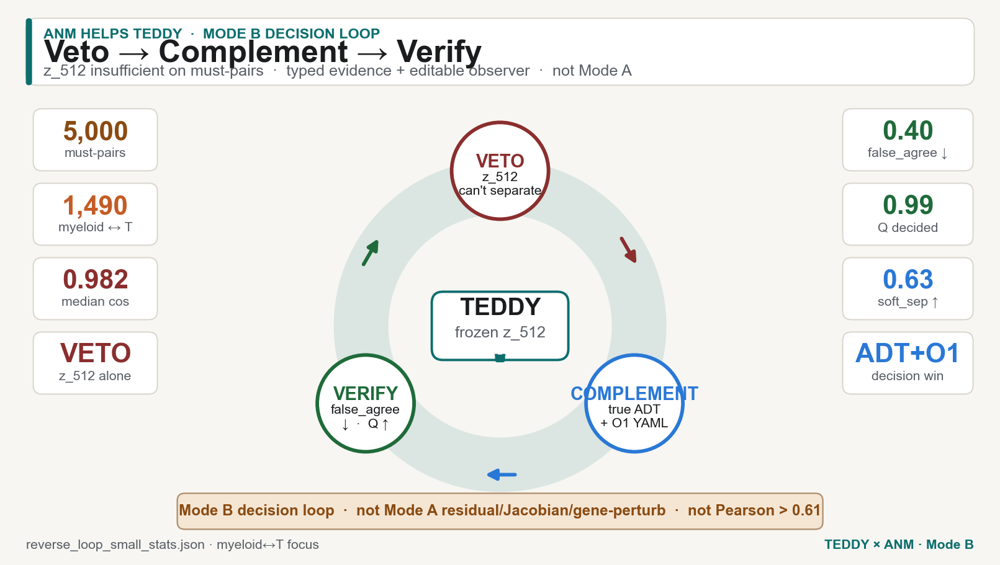
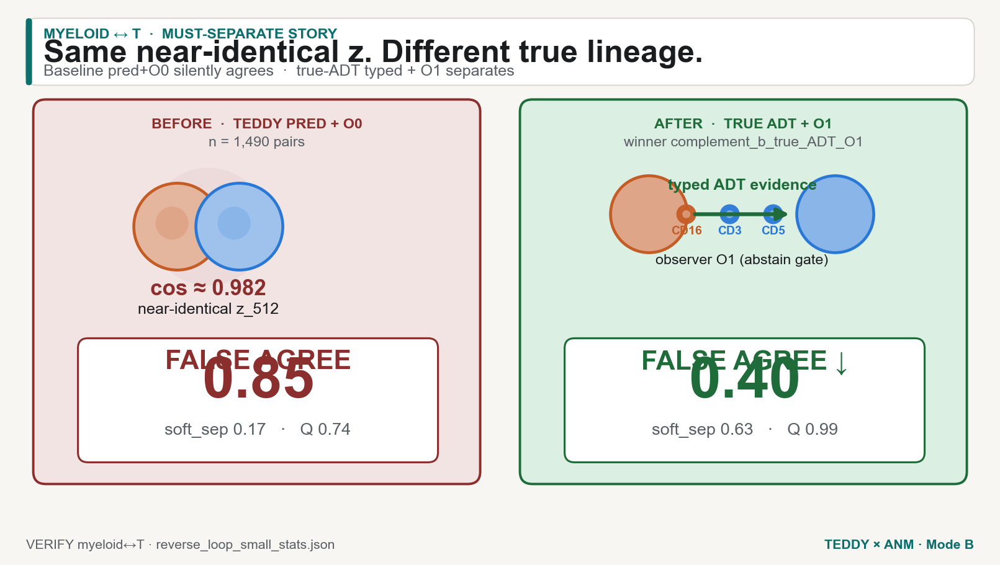
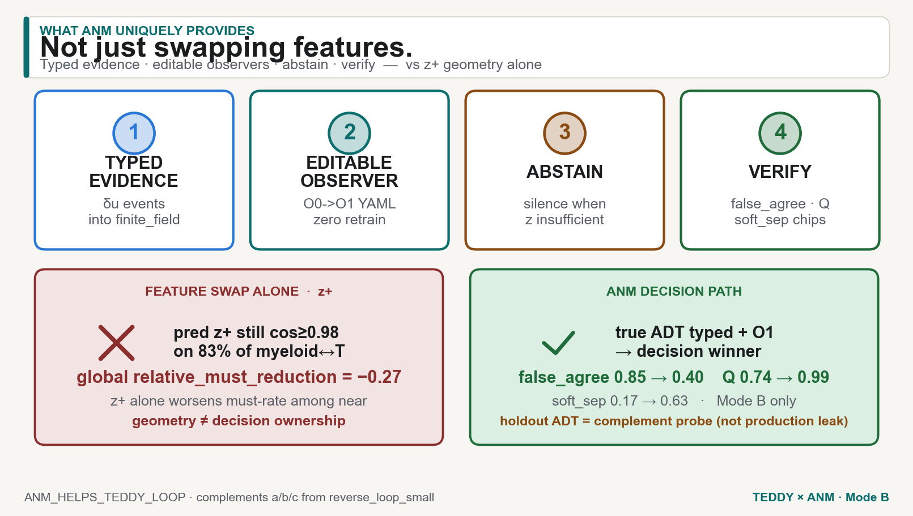

# How the ANM reverse decision loop helps TEDDY

**English primary.** Figure-first. Verified numbers only (from `reverse_loop_small_stats.json` / `REVERSE_LOOP_SMALL.md` / `REVERSE_STEP1.md`).  
**Mode B** sufficiency-for-readout + typed-evidence decision loop — **not** Mode A residual-as-field / Jacobian / gene-perturb.

> **Interactive version →** [danielchen26.github.io/teddy_mm/anm-loop.html](https://danielchen26.github.io/teddy_mm/anm-loop.html) — step-through veto → complement → verify, scoreboard by arm × metric × pair set, ANM vs feature swap. Same numbers as this file.

Homepage section: [teddy_mm/#anm-loop](https://danielchen26.github.io/teddy_mm/#anm-loop) · source figures in [`docs/assets/infographics/`](../assets/infographics/).

---

## Chinese summary（中文摘要）

TEDDY 冻结的 `z_512`（mean-pool last-layer @ ctx 1024，L2 512-D）在 **must-separate** 对上不够用：近邻余弦 ≥0.98 却携带冲突的真实 ADT 谱系/蛋白标签。ANM 的 Mode B **决策闭环** = **否决 → 补证据 → 核验**：否决 `z_512` 单独充分性；用 **真 ADT 类型化证据 + O1 可编辑观察者** 补洞；在同一 myeloid↔T 对上核验 `false_agree`↓、`Q`↑、`soft_sep`↑。  
这不是换特征（`z⁺` 几何单独反而恶化全局 must-rate），也不是 Mode A，也不是 Pearson > ~0.61。

---

## Poster 1 — the loop



*Dark: [`06_anm_loop_poster_dark.png`](../assets/infographics/06_anm_loop_poster_dark.png).*

```
        ┌──────── VETO ────────┐
        │  z_512 insufficient  │
        └──────────┬───────────┘
                   │
                   ▼
        ┌──── COMPLEMENT ──────┐
        │ true ADT typed + O1  │
        └──────────┬───────────┘
                   │
                   ▼
        ┌────── VERIFY ────────┐
        │ false_agree · Q · sep│
        └──────────────────────┘
```

Pipeline claim boundary (`claim_boundary` in stats JSON):

| In | Out |
|---|---|
| Mode B reverse **decision** loop: veto → complement → verify | Mode A residual stream as field |
| Typed evidence + editable observer YAML | Layer Jacobian / in-silico gene perturbs |
| True-ADT events as **explicit complement probe** | Fusion audit / clinical |
| Holdout ADT stays verifier-only on production path | Pearson > phase-1 full-ADT **~0.61** |

---

## 1) TEDDY alone expectation vs must-separate gap

### What TEDDY alone is expected to provide

Frozen CITE map: RNA → TEDDY-G → **`z_512`** (mean-pool last-layer tokens @ context **1024**, L2-normalized full 512-D) → ADT preds → panel rules. Phase-1 full-ADT Pearson reference **~0.61**. Downstream readout is expected to treat nearby `z` as same biology.

### What the must-separate probe finds (veto)

Near-identical `z_512` pairs can still disagree on true ADT lineage / protein profile. That is a **sufficiency-for-readout** gap — Mode B evidence geometry — not a claim that TEDDY’s residual responds to perturbs.

| Chip | Value | Source |
|---|---:|---|
| Pairs written | **5,000** | reverse step1 → loop |
| Unique cells | **2,872** | stats `inputs` |
| Myeloid↔T pairs | **1,490** (frac **0.298**) | veto |
| Myeloid↔T cos median | **0.9822** (min 0.9800 · max 0.9905) | veto |
| Diff ADT lineage (flags) | **2,059** | veto `flag_counts` |
| Diff protein profile | **4,639** | veto |
| Diff key-marker lineage | **3,287** | veto |

Focus protein |Δ| on myeloid↔T (true ADT):

| Protein | mean \|Δ\| | median \|Δ\| | q75 \|Δ\| |
|---|---:|---:|---:|
| CD16 | 1.065 | 0.907 | 1.776 |
| CD5 | 0.716 | 0.408 | 1.087 |
| CD3 | 0.698 | 0.362 | 0.866 |

**Veto sentence (stats):**  
`z_512` is **INSUFFICIENT** to separate these must-pairs: near-identical `z` carries disagreeing true ADT lineage / protein labels. Downstream readout must **abstain**, **rewrite observer**, or **admit a complement evidence channel**.

Baseline on myeloid↔T with **pred + O0** (TEDDY-alone style readout):

| Metric | baseline_pred_O0 |
|---|---:|
| false_agree (both decided) | **0.8537** |
| soft_separation_rate | **0.1738** |
| Q_among_decided | **0.7410** |

TEDDY alone, on the hard gap, **mostly false-agrees**.

---

## 2) Veto → complement → verify (myeloid↔T)

### Poster 2 — before / after



*Dark: [`07_myeloid_t_before_after_dark.png`](../assets/infographics/07_myeloid_t_before_after_dark.png).*

### Complement arms (no TEDDY retrain)

| Arm | What it is |
|---|---|
| (a) `O1_abstain` | Observer rewrite: threshold 0.12→0.28, key_marker_boost×2 |
| (a) `O2_observer` | Key-marker priority observer (rewrites expected) |
| (b) `true_ADT_typed` + O0/O1 | Admit holdout **true ADT** as typed ANM source events (**probe only**; production keeps ADT verifier-only) |
| (c) `z⁺` | Concat ADT features into geometry; **not** the decision winner |

### Verify — myeloid↔T focus (n=1,490)

| Complement | soft_sep | false_agree | Q_among_decided | correct_sep | abstain_pair |
|---|---:|---:|---:|---:|---:|
| `baseline_pred_O0` | 0.1738 | **0.8537** | 0.7410 | 0.0839 | 0.0322 |
| `complement_a_O1_abstain` | 0.2242 | 0.8311 | 0.7778 | 0.0322 | 0.0664 |
| `complement_a_O2_observer` | 0.3725 | 0.8431 | 0.8824 | 0.0839 | 0.2557 |
| `complement_b_true_ADT_O0` | 0.5477 | 0.4569 | 0.9717 | **0.3685** | 0.0101 |
| **`complement_b_true_ADT_O1`** | **0.6255** | **0.3966** | **0.9868** | 0.1725 | 0.0557 |
| `complement_c_zplus_geometry`* | 0.7208 | 0.0940† | — | — | — |

\*Geometry proxy only (frac cos dropped &lt;0.95 / still ≥0.98); not a decision Q.  
†Here “false_agree” = frac still cos ≥0.98 under true-ADT `z⁺` (geometry leftover), not action agreement.

### Winner

**`complement_b_true_ADT_O1`** — score = soft_sep + Q − false_agree ≈ **2.841**.

Headline deltas vs baseline (myeloid↔T):

| Chip | Before | After (true ADT + O1) |
|---|---:|---:|
| false_agree | 0.85 | **0.40** |
| soft_sep | 0.17 | **0.63** |
| Q_among_decided | 0.74 | **0.99** |

Same story on the full written must-set (n=5,000): false_agree 0.893 → 0.586; Q 0.808 → 0.990; soft_sep 0.167 → 0.469 under true-ADT+O1.

---

## 3) What ANM uniquely provides (vs swapping features)

### Poster 3 — missing-link redirect



*Dark: [`08_anm_vs_feature_swap_dark.png`](../assets/infographics/08_anm_vs_feature_swap_dark.png).*

| ANM unique | What it means here | Feature-swap substitute? |
|---|---|---|
| **Typed evidence** | δu events into ANM `finite_field` (true ADT as typed source for this probe) | Concat floats into `z⁺` — no decision semantics |
| **Editable observers** | O0→O1 YAML (threshold / boost) without TEDDY retrain | Retrain / retune readout weights |
| **Abstain** | Declared silence when evidence insufficient | Softmax still answers |
| **Verify** | Same must-pairs → false_agree / Q / soft_sep chips | Cosine drop ≠ decision ownership |

### Why `z⁺` alone is not the answer

On the **fixed** myeloid↔T must-pairs, true-ADT `z⁺` does lower cosine (frac still ≥0.98 = **0.094**; frac &lt;0.95 = **0.721**) — geometry *can* separate this fixed set. Pred `z⁺` does **not** (frac still ≥0.98 = **0.835**).

But the prior **global** `z⁺` probe (held myeloid) found:

> relative_must_reduction primary = **−0.2727** → **NEGATIVE** ⇒ `z⁺` alone **worsens** must-rate among its own near neighborhoods.

**Decision winner remains true-ADT typed evidence + O1, not `z⁺` alone.** Geometry help on a fixed pair list ≠ owning the decision loop.

---

## 4) Honest boundary

| Claim | Status |
|---|---|
| Mode B **decision** loop (veto → complement → verify) | **Yes** — this report |
| True ADT as typed **complement** evidence for this probe | **Yes** — explicit; production path keeps holdout ADT **verifier-only** |
| Mode A residual-as-field / layer Jacobian / gene perturbs | **No** |
| Reverse closed loop as representation response to perturbs | **No** (name collision: this is a *decision* loop) |
| Pearson > phase-1 full-ADT **~0.61** | **No** |
| Clinical superiority | **No** |
| TEDDY `best.pt` retrain | **No** |

`z_512` definition (loading factor): mean-pool **last-layer** tokens @ context **1024** (not pretrain 2048, not disease token). Full L2 `outputs/anm_cite_bridge/z_rna_512.npy`. Compact `z_rna_export.npy` (`z_keep=32`) is **not** the reverse probe space.

---

## Proof sentence

> On reverse_step1 must-separate pairs (5,000 written; 1,490 myeloid↔T with median cos 0.982), TEDDY `z_512` alone is insufficient for readout (baseline false_agree 0.85, soft_sep 0.17, Q 0.74). The Mode B ANM decision loop vetoes sufficiency, admits true-ADT typed evidence + editable O1 observer as complement, and verifies false_agree → 0.40, soft_sep → 0.63, Q → 0.99 — without TEDDY retrain. Swapping features into `z⁺` is not enough (global relative_must_reduction −0.27). Not Mode A. Not Pearson > ~0.61. Not clinical.

---

## Reproduce

```bash
cd teddy_mm
# reverse step1 must-pairs (if regenerating)
.venv/bin/python bridge_anm/reverse_step1_must_separate.py
# Mode B veto → complement → verify
PYTHONPATH=/path/to/ANM:. .venv/bin/python bridge_anm/reverse_loop_small.py
# NotebookLM-style posters
/usr/bin/python3 scripts/make_anm_helps_teddy_loop_figures.py
```

Artifacts:

- Stats: [`reverse_loop_small_stats.json`](reverse_loop_small_stats.json)
- Sibling reports: [`REVERSE_LOOP_SMALL.md`](REVERSE_LOOP_SMALL.md) · [`REVERSE_STEP1.md`](REVERSE_STEP1.md) · [`MODE_B_SCOPE.md`](../MODE_B_SCOPE.md)
- Figures: `docs/assets/infographics/06_anm_loop_poster_{light,dark}.png` · `07_myeloid_t_before_after_{light,dark}.png` · `08_anm_vs_feature_swap_{light,dark}.png`

Generated: 2026-09-27 (America/New_York).
